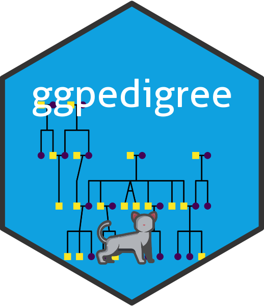

<!-- README.md is generated from README.Rmd. Please edit that file -->

```{r, include = FALSE}
knitr::opts_chunk$set(
  collapse = TRUE,
  comment = "#>",
  fig.path = "man/figures/README-",
  out.width = "100%"
)
options(citation.bibtex.max = 0)
```

# ggpedigree

<!-- badges: start -->
<a href="https://r-computing-lab.github.io/ggpedigree/"></a>
[](https://www.repostatus.org/#active)
[](https://CRAN.R-project.org/package=ggpedigree)
[](https://cran.r-project.org/web/checks/check_results_ggpedigree.html)
[](https://cranlogs.r-pkg.org/badges/grand-total/ggpedigree)
[](https://app.codecov.io/gh/R-Computing-Lab/ggpedigree)</br>
[](https://github.com/R-Computing-Lab/ggpedigree/actions/workflows/R-CMD-check.yaml)
[](https://github.com/R-Computing-Lab/ggpedigree/actions/workflows/R-CMD-devcheck.yaml)
[](https://github.com/R-Computing-Lab/ggpedigree/actions/workflows/pkgdown.yaml)
[](https://www.gnu.org/licenses/gpl-3.0.html)
[](https://joss.theoj.org/papers/e5116b83b03e2740960d1153c45f9480)


<!-- badges: end -->

`ggpedigree` provides modern tools for visualizing family trees and pedigree structures using both `ggplot2` and `plotly`. Specifically, it enables the creation of static and interactive pedigree plots that can accommodate complex family relationships, including duplicated individuals and various mating structures.

The package complements the behavior genetics toolkit `BGmisc` [Garrison et al. (2024) <doi:10.21105/joss.06203>] for tasks such as pedigree validation and computing relatedness matrices. Core plotting functions (`ggPedigree()`, `ggPedigreeInteractive()`, `calculateCoordinates()`) work on any rectangular pedigree and ship with built-in example data, while relatedness workflows reuse matrix builders from `BGmisc`. Due to the impending deprecation of `kinship2`, version 1.0 incorporates the layout helper functions from kinship2. The pedigree alignment algorithms are adapted from 'kinship2' [Sinnwell et al. (2014) <doi:10.1159/000363105>]. We gratefully acknowledge the original authors: Jason Sinnwell, Terry Therneau, Daniel Schaid, and Elizabeth Atkinson for their foundational work. 


See the [package vignettes](https://r-computing-lab.github.io/ggpedigree/articles/) for end-to-end tutorials, including relatedness matrices and interactive plots.

## Installation

You can install the released version of ggpedigree from [CRAN](https://cran.r-project.org/) with:

```r
install.packages("ggpedigree")
```

To install the development version of `ggpedigree` from [GitHub](https://github.com/) use:

```r
# install.packages("devtools")
devtools::install_github("R-Computing-Lab/ggpedigree")
```

## Demonstration

```{r load-data, include=FALSE}
library(ggpedigree) # ggPedigree lives here
library(BGmisc) # helper utilities & example data
library(tidyverse)
# if you don't have the most recent version of BGmisc, you may need to install it first as a stop-gap I've added the data loading here

potter <- BGmisc::potter ## avoid error

if (!"twinID" %in% names(potter)) {
  # Add twinID and zygosity columns for demonstration purposes
  potter <- potter %>%
    mutate(
      twinID = case_when(
        name == "Fred Weasley" ~ 13,
        name == "George Weasley" ~ 12,
        TRUE ~ NA_real_
      ),
      zygosity = case_when(
        name == "Fred Weasley" ~ "mz",
        name == "George Weasley" ~ "mz",
        TRUE ~ NA_character_
      )
    )
}
```

Here is a basic example of how to use `ggpedigree` to visualize a pedigree structure. The `potter` dataset contains simulated pedigree data for the Weasley family from the Harry Potter series.

```{r basic-usage,out.width = "80%"}
library(ggpedigree) # ggPedigree lives here
library(BGmisc) # helper utilities & example data
potter <- BGmisc::potter # load example data
ggPedigree(potter,
  famID = "famID",
  personID = "personID"
)
```

```{r slightly-usage,out.width = "80%"}
ggPedigree(potter,
  famID = "famID",
  personID = "personID",
  config = list(
    color_theme = "greyscale")
)
```


## Citation

If you use ggpedigree in your research or wish to refer to it, please cite the following:

```
citation(package = "ggpedigree")
```

```{r,comment='',results='asis',echo=FALSE} 
print(citation(package = "ggpedigree"), style = "text", bibtex = FALSE)
```

A BibTeX entry for LaTeX users is
```{r,comment='',echo=FALSE}
toBibtex(citation(package = "ggpedigree"))
```

## Contributing

Contributions to the ggpedigree project are welcome. For guidelines on how to contribute, please refer to the [Contributing Guidelines](https://github.com/R-Computing-Lab/ggpedigree/blob/main/CONTRIBUTING.md). Issues and pull requests should be submitted on the GitHub repository. For support, please use the GitHub issues page.


### Branching and Versioning System
The development of ggpedigree follows a [GitFlow branching strategy](https://docs.gitlab.com/user/project/repository/branches/strategies/):

- **Feature Branches**: All major changes and new features should be developed on separate branches created from the dev branch. Name these branches according to the feature or change they are meant to address.
- **Development Branch**: The `dev` branch is the main development branch where all feature branches are merged. This branch contains the latest changes and is used for testing and development purposes.
- **Main Branch** (`main`): The main branch mirrors the stable state of the project as seen on CRAN. Only fully tested and approved changes from the dev branch are merged into main to prepare for a new release.


## License
ggpedigree is licensed under the GNU General Public License v3.0. For more details, see the [LICENSE.md](https://github.com/R-Computing-Lab/ggpedigree/blob/main/LICENSE.md) file.

