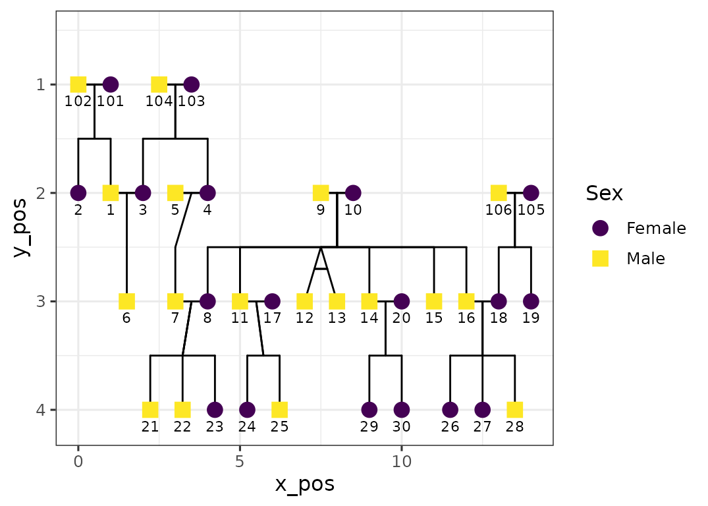
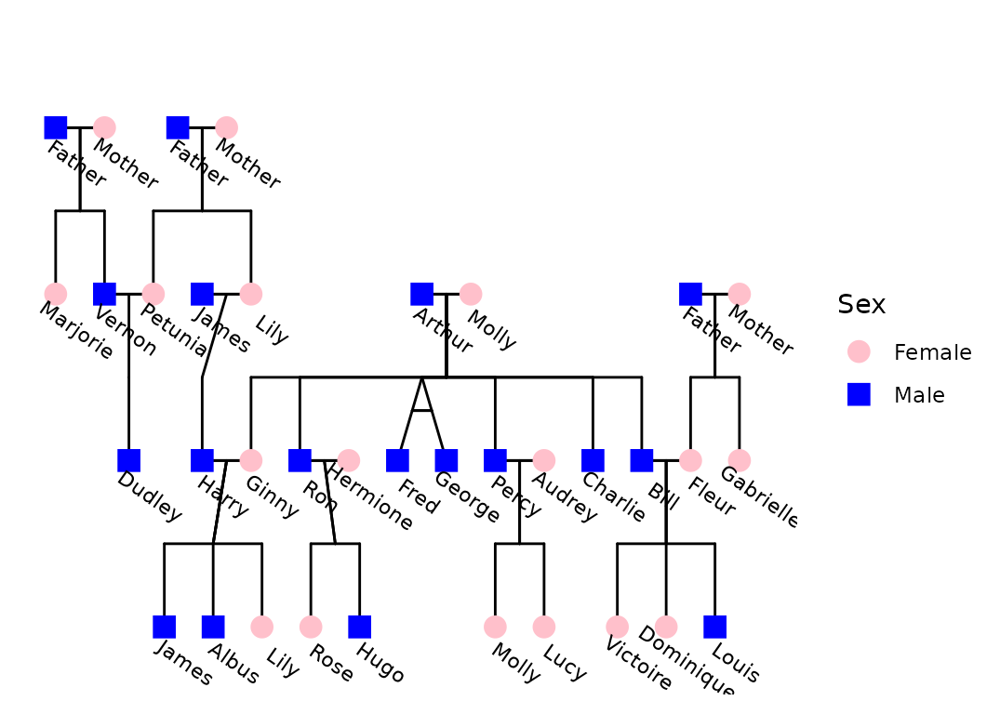
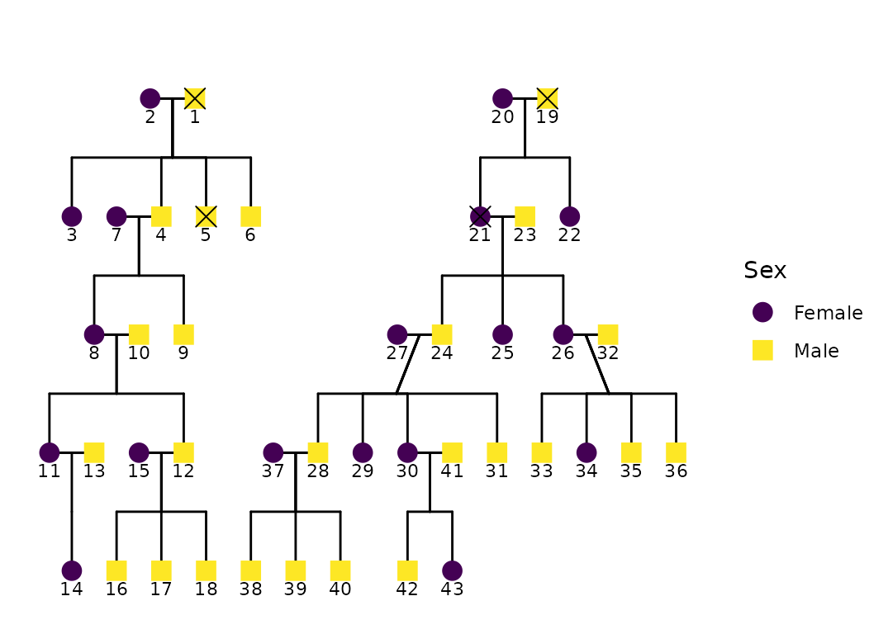
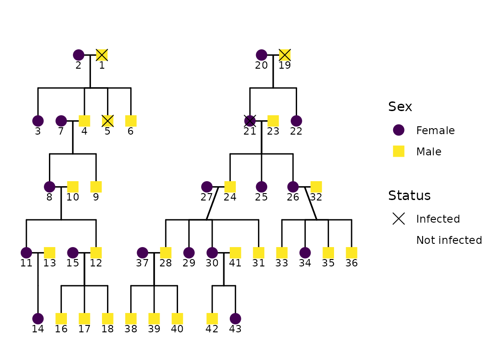
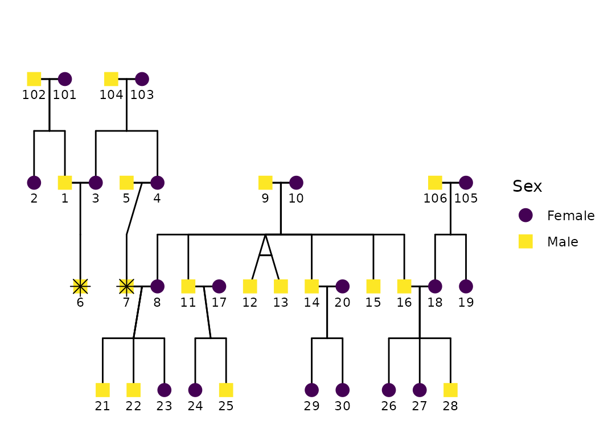
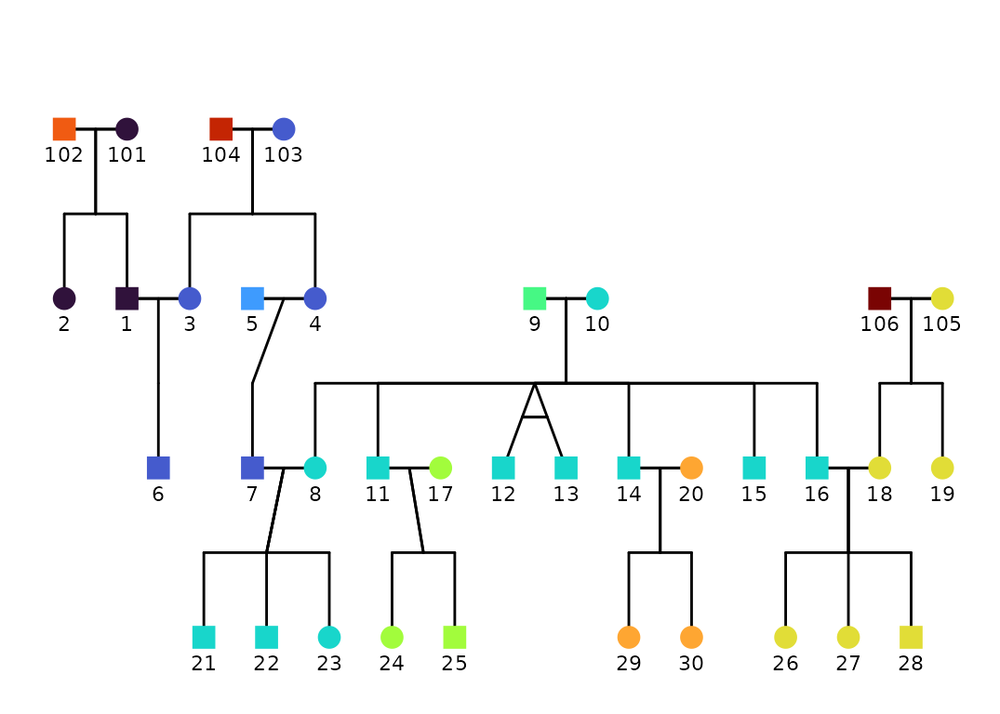
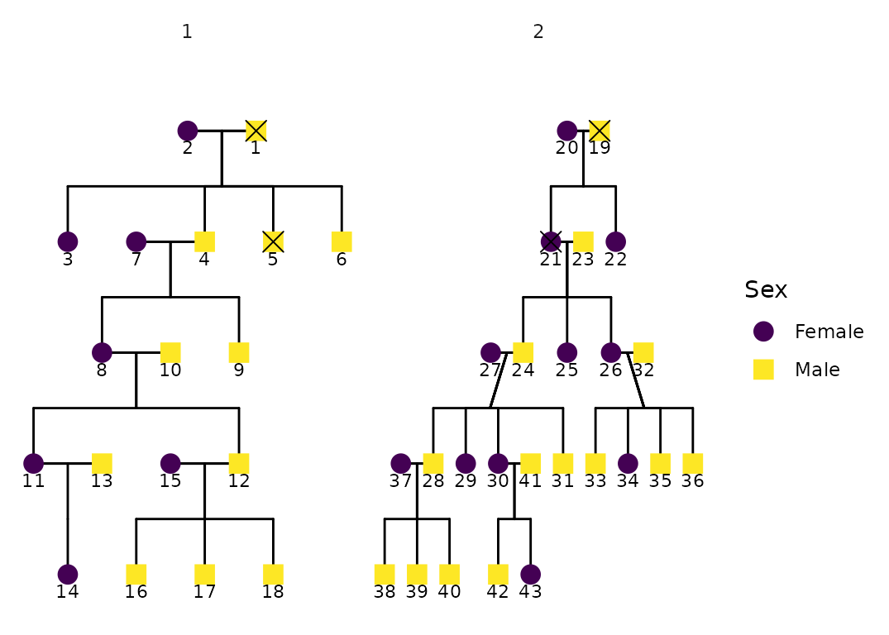

# Plotting pedigrees with ggPedigree()

## Introduction

This vignette demonstrates pedigree visualization with
[`ggPedigree()`](https://r-computing-lab.github.io/ggpedigree/reference/ggPedigree.md)
from `ggpedigree`. Pedigree plots are central to fields like human
genetics, behavioral science, and genealogy, where understanding lineage
and familial relationships informs diagnosis, analysis, and
interpretation.

[`ggPedigree()`](https://r-computing-lab.github.io/ggpedigree/reference/ggPedigree.md)
builds on `ggplot2` and `kinship2`, leveraging modular helpers from both
[BGmisc](https://github.com/R-Computing-Lab/BGmisc/) and
[ggpedigree](https://github.com/R-Computing-Lab/ggpedigree/) to
streamline plot generation while retaining full aesthetic flexibility.

Unlike base R pedigree tools, this package returns a `ggplot2` object,
meaning users can customize their output using familiar `ggplot2`
syntax, themes, scales, and layering. Throughout this vignette, we walk
through basic usage, layout control, status overlays, aesthetic
customization, and faceting for multifamily visualization.

We use two bundled example datasets (from `BGmisc`) to illustrate the
package’s capabilities. The first dataset, `potter`, contains a
fictional wizarding family tree, while the second dataset, `hazard`,
includes a multi-generational historical pedigree with
affected/unaffected status.

## Basic usage

We begin by loading the required libraries. These include the main
plotting package `ggpedigree`, helper utilities from `BGmisc`, and
supporting tools for aesthetic and data manipulation.

``` r
library(ggpedigree) # ggPedigree lives here
library(BGmisc) # helper utilities & example data
library(ggplot2) # ggplot2 for plotting
library(viridis) # viridis for color palettes
library(tidyverse) # for data wrangling
```

The simplest usage requires a data frame and column names for family and
individual IDs. Here’s a basic pedigree plot using the `potter` data:

``` r
ggPedigree(potter,
  famID = "famID",
  personID = "personID"
)
```


Behind the scenes,
[`ggPedigree()`](https://r-computing-lab.github.io/ggpedigree/reference/ggPedigree.md):

1.  reshapes the data by family
    ([`ped2fam()`](https://r-computing-lab.github.io/BGmisc/reference/ped2fam.html)),

2.  recodes sex (e.g., 0/1/NA) into semantic labels via
    [`recodeSex()`](https://r-computing-lab.github.io/BGmisc/reference/recodeSex.html)

3.  extracts a layout grid with
    [`calculateCoordinates()`](https://r-computing-lab.github.io/ggpedigree/reference/calculateCoordinates.md)

4.  builds connection segments for spouses, siblings, parents, and
    offspring with
    [`calculateConnections()`](https://r-computing-lab.github.io/ggpedigree/reference/calculateConnections.md)

The result is returned as a `ggplot2` object, which allows immediate
post-processing with standard `ggplot` syntax.

## Customizing Aesthetics

Most appearance settings are managed through a `config` list, which
allows for fine-tuned customization. If any options are omitted, they
fall back to predefined defaults. For example, we can turn off sex-based
fill color and assign specific colors to connection segments, while also
changing the shapes of individuals in the pedigree:

``` r
ggPedigree(
  potter,
  famID = "famID",
  personID = "personID",
  config = list(
    code_male = 1, # Here, 1 = male, 0 = female
    sex_color_include = FALSE,
    segment_linewidth = .75,
    point_size = 5,
    outline_multiplier = 1.5,
    # outline_additional_size = -1,
    sex_shape_female = "💸",
    sex_shape_male = "🖤",
    segment_spouse_color = viridis_pal()(5)[1],
    segment_sibling_color = viridis_pal()(5)[2],
    segment_parent_color = viridis_pal()(5)[3],
    segment_offspring_color = viridis_pal()(5)[4],
    segment_mz_color = viridis_pal()(5)[5],
    #   segment_linetype = 3,
    outline_include = FALSE,
    outline_color = "grey"
  )
)
```


As with any `ggplot2` object, further theming and labeling can be
applied using layers or themes. For instance:

``` r
ggPedigree(potter,
  famID = "famID",
  personID = "personID"
) +
  theme_bw(base_size = 12) + scale_colour_brewer(palette = "Set2")
#> Scale for colour is already present.
#> Adding another scale for colour, which will replace the existing scale.
```



This can be particularly useful for matching house styles in academic
publications or removing clutter for presentations.

### Labeling Individuals

You can also label individuals in the pedigree using the `label_method`
argument. The default is
[`geom_text()`](https://ggplot2.tidyverse.org/reference/geom_text.html)
for simpler labeling. You can also use `geom_label_repel()`, which uses
the `ggrepel` package to avoid overlapping labels. Other configurable
options include `label_column` for the label column, `label_text_angle`
for text rotation, `label_nudge_y` for vertical adjustment, and
`label_nudge_x` for horizontal adjustment.

``` r
ggPedigree(
  potter,
  famID = "famID",
  personID = "personID",
  config = list(
    label_column = "first_name",
    sex_color_palette = c("pink", "blue"),
    label_text_angle = -35,
    label_nudge_y = .215,
    label_nudge_x = 0.45,
    label_method = "geom_text", # "ggrepel", #
    #   sex_color_palette = c("black", "black"),
    sex_color_include = TRUE
  )
)
```



## Overlaying Status Information

In many applied settings, pedigrees include binary phenotypes such as
affected/unaffected status. To incorporate this, use the `status_column`
argument to point to a column containing the relevant variable.

``` r
data("hazard")

p <- ggPedigree(
  hazard,
  famID = "famID",
  personID = "ID",
  status_column = "affected",
  config = list(
    code_male = 0,
    sex_color_include = TRUE,
    status_code_affected = TRUE,
    status_code_unaffected = FALSE,
    status_shape_affected = 4
  )
)

p
```



The `status_column` argument allows you to specify a column that
identifies affected/unaffected individuals. This column should be a
factor or character vector; if not,
[`ggPedigree()`](https://r-computing-lab.github.io/ggpedigree/reference/ggPedigree.md)
will coerce it.

The behavior differs depending on whether `sex_color_include` is also
enabled:

- If `sex_color_include = TRUE`, affected individuals are overlaid with
  a shape (controlled by `status_shape_affected`), preserving the fill
  color by sex.

- If `sex_color_include = FALSE`, affected and unaffected individuals
  are instead colored by status, using a default fill scale.

You can control how values are interpreted via the `affected` and
`unaffected` parameters in `config`. By default, `TRUE` is considered
affected and `FALSE` unaffected.

``` r
ggPedigree(
  hazard,
  famID = "famID",
  personID = "ID",
  status_column = "affected",
  overlay_column = NULL,
  config = list(
    code_male = 0,
    sex_color_include = TRUE,
    status_include = TRUE,
    overlay_include = FALSE,
    status_code_affected = TRUE,
    status_code_unaffected = FALSE,
    status_label_affected = "Infected",
    status_label_unaffected = "Not infected",
    status_legend_title = "Status",
    focal_fill_include = FALSE,
    status_shape_affected = 4, # "🦠"  # virus shape
    status_legend_show = TRUE
  )
)
```



### Highlighting Specific Individuals

You can also highlight specific individuals in the pedigree through
other approaches, such as by creating a new column in your data frame.
For example, if you want to highlight Harry Potter and Dudley Dursley,
you can create a new column called `proband` and set it to `TRUE` for
those individuals. You can specify the `status_shape_affected` to be a
star shape (8) and use the `status_column` argument to indicate the
probands.

``` r
df <- potter

df <- df %>%
  mutate(proband = ifelse(name %in% c(
    "Harry Potter",
    "Dudley Dursley"
  ), TRUE, FALSE))

ggPedigree(
  df,
  famID = "famID",
  personID = "personID",
  status_column = "proband",
  config = list(
    sex_color_include = TRUE,
    status_include = TRUE,
    status_code_affected = TRUE,
    status_code_unaffected = FALSE,
    status_shape_affected = 8 # "✨"  # star shape
  )
)
```



### Highlighting Harry Potter

Alternatively, you can use what I’ve called focal filling. The
`focal_fill` argument allows you to highlight one person and their
relatives without modifying the data frame. This is particularly useful
when you want to emphasize a specific individual, such as Harry Potter,
in the pedigree plot. The `focal_fill_personID` argument allows you to
specify the person ID to highlight, and the `focal_fill_include`
argument determines whether to include this highlighting in the plot.
Other arguments like `focal_fill_method`, `focal_fill_n_breaks`, and
`focal_fill_scale_midpoint` control the appearance of the highlighted
area. Notably, you can select focal_fill_component to a specific
component, such as “additive”, which will highlight the additive genetic
relatives of the focal person.

``` r
ggPedigree(potter,
  famID = "famID",
  personID = "personID",
  config = list(
    focal_fill_personID = 7,
    focal_fill_include = TRUE,
    #  focal_fill_high_color = "yellow",
    #  focal_fill_mid_color = "red",
    #   focal_fill_low_color = "#0D082AFF",
    focal_fill_force_zero = TRUE,
    focal_fill_na_value = "black",
    focal_fill_scale_midpoint = 0.25,
    focal_fill_component = "additive",
    focal_fill_method = "gradient",
    focal_fill_n_breaks = NULL,
    focal_fill_legend_title = "Genetic Relatives \nof Harry Potter",
    # "additive",
    sex_color_include = FALSE,
    sex_legend_show = FALSE
  ) # highlight Harry Potter
  # config  = list(segment_mz_color = NA) # color for monozygotic twins
)
```


Here we highlight Harry Potter (ID 7) and his relatives in the pedigree
plot. Other components can be highlighted by changing the
`focal_fill_component` argument. For example, you can set it to
“mitochondrial” to highlight mitochondrial relatives, or “x” to
highlight X-linked relatives. The `focal_fill_method` can be set to
“gradient” for a smooth gradient effect or “steps” for distinct color
breaks.

``` r
m1 <- ggPedigree(potter,
  famID = "famID",
  personID = "personID",
  config = list(
    focal_fill_personID = 7,
    focal_fill_include = TRUE,
    focal_fill_high_color = "green",
    # focal_fill_mid_color = "white",
    focal_fill_low_color = "black",
    focal_fill_scale_midpoint = 0.55,
    focal_fill_component = "mitochondrial",
    focal_fill_method = "steps",
    focal_fill_n_breaks = 19,
    focal_fill_legend_show = FALSE,
    focal_fill_legend_title = "Mitochondrial Relatives \nof Harry Potter",
    sex_color_include = FALSE,
    label_text_size = 3
  ) # highlight Harry Potter
  # config  = list(segment_mz_color = NA) # color for monozygotic twins
) + ggplot2::guides(shape = "none")
m2 <- ggPedigree(potter,
  famID = "famID",
  personID = "personID",
  config = list(
    focal_fill_personID = 8,
    focal_fill_include = TRUE,
    focal_fill_high_color = "orange",
    # focal_fill_mid_color = "white",
    focal_fill_low_color = "black",
    focal_fill_scale_midpoint = 0.55,
    focal_fill_component = "mitochondrial",
    focal_fill_method = "steps",
    focal_fill_n_breaks = 19,
    focal_fill_legend_show = FALSE,
    focal_fill_legend_title = "Mitochondrial Relatives \nof Ginny Weasley",
    sex_color_include = FALSE,
    label_text_size = 3
  ) # highlight Harry Potter
  # config  = list(segment_mz_color = NA) # color for monozygotic twins
) + ggplot2::guides(shape = "none")

library(patchwork) # for combining plots
m1 + m2 + plot_layout(ncol = 2) +
  plot_annotation(title = "Mitochondrial Relatives of Harry Potter and Ginny Weasley")
```


``` r
ggPedigree(potter,
  famID = "famID",
  personID = "personID",
  config = list(
    focal_fill_personID = 8,
    focal_fill_include = TRUE,
    # focal_fill_mid_color = "white",
    focal_fill_low_color = "black",
    focal_fill_scale_midpoint = 0.55,
    focal_fill_component = "matID",
    focal_fill_method = "viridis_d",
    focal_fill_viridis_option = "turbo",
    focal_fill_n_breaks = 19,
    focal_fill_legend_show = FALSE,
    focal_fill_legend_title = "Mitochondrial Relatives",
    sex_color_include = FALSE,
    overlay_include = FALSE
  ) # highlight Harry Potter
  # config  = list(segment_mz_color = NA) # color for monozygotic twins
) + ggplot2::guides(shape = "none")
```



## Multiple families in one graphic

If you have multiple families in your data frame, you can use the
[`facet_wrap()`](https://ggplot2.tidyverse.org/reference/facet_wrap.html)
function from `ggplot2` to create separate plots for each family. This
is useful if you want to compare the pedigrees of different families
side by side. Note that you can use `scales = "free_x"` to allow each
family to have its own x-axis scale.

``` r
p +
  facet_wrap(~famID, scales = "free_x")
```



## Adjusting Plot Appearance

The layout appearance can be refined using
[`theme()`](https://ggplot2.tidyverse.org/reference/theme.html)
elements. This doesn’t change the pedigree structure but helps declutter
the visualization.

``` r
p +
  theme_bw(base_size = 12) +
  theme(
    panel.grid.major = element_blank(),
    panel.grid.minor = element_blank(),
    panel.background = element_blank(),
    axis.line        = element_line(colour = "black"),
    axis.text.x      = element_blank(),
    axis.text.y      = element_blank(),
    axis.ticks.x     = element_blank(),
    axis.ticks.y     = element_blank(),
    axis.title.x     = element_blank(),
    axis.title.y     = element_blank()
  ) +
  scale_color_viridis(
    option = "mako",
    discrete = TRUE,
    labels = c("Female", "Male", "Unknown")
  )
#> Scale for colour is already present.
#> Adding another scale for colour, which will replace the existing scale.
```


## Advanced Examples: Large Pedigrees with self-loops

Additional examples are available in the online documentation to keep
the package file size reasonable. These are provided as articles that
demonstrate more complex pedigree plots. You can find these on the
[ggpedigree website](https://r-computing-lab.github.io/ggpedigree/).
These articles cover advanced topics such as: multiple families,
self-loops, and other advanced features.
