# Extended: More uses of config to control ggpedigree plots

``` r

library(ggpedigree) # ggPedigree lives here
library(BGmisc) # helper utilities & example data
library(ggplot2) # ggplot2 for plotting
library(viridis) # viridis for color palettes
library(tidyverse) # for data wrangling
```

Every gg-based plotting function in
[ggpedigree](https://github.com/R-Computing-Lab/ggpedigree/) accepts a
`config` argument. This is an easier way to control plot behavior
without rewriting the plotting code.

As already discussed, a `config` is a named list. Each element
corresponds to one plotting, layout, or aesthetic option. You pass the
list to the plotting function and the plot is drawn using those values.

You do not need to supply every option. You only provide the options you
want to change. Any options you do not specify will use the package
defaults. You can see a full list of supported options and their
defaults by reviewing the documentation for
[`getDefaultPlotConfig()`](https://r-computing-lab.github.io/ggpedigree/reference/getDefaultPlotConfig.md).

## Basic usage of `config` in `ggPedigree()`

As before, we will use the `potter` pedigree dataset bundled in
[BGmisc](https://github.com/R-Computing-Lab/BGmisc/).

``` r

library(BGmisc)
data("potter")
```

A basic pedigree plot uses defaults:

``` r

ggPedigree(
  potter,
  famID = "famID",
  personID = "personID",
  momID = "momID",
  dadID = "dadID"
)
```

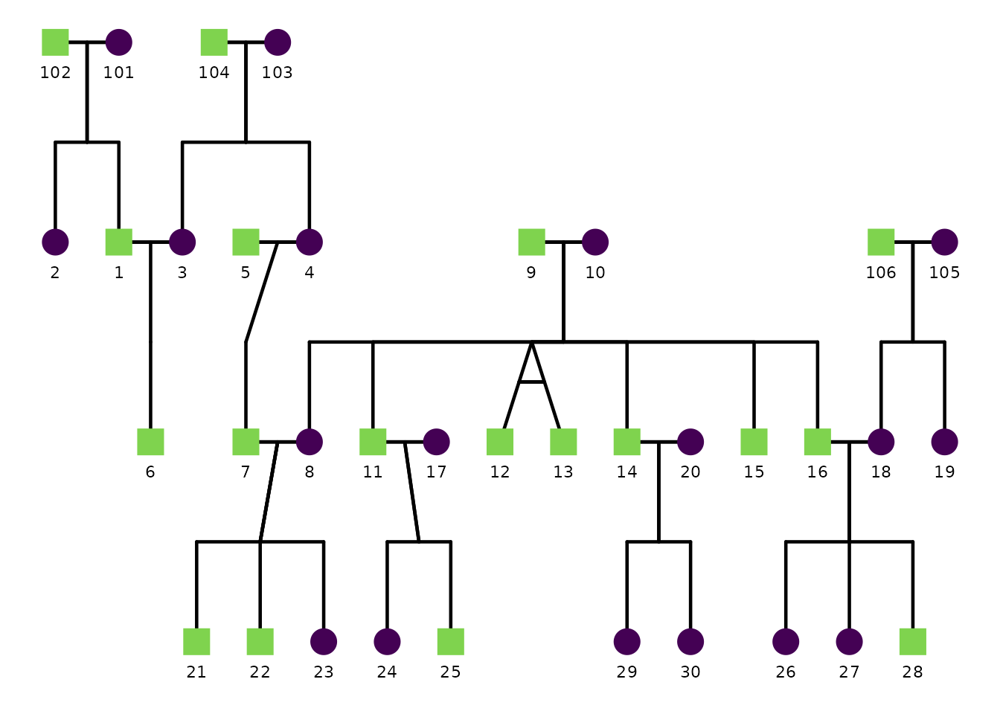

### Sex coding: `code_male` and `code_female`

[`ggPedigree()`](https://r-computing-lab.github.io/ggpedigree/reference/ggPedigree.md)
(and other ggpedigree plots that use sex) need to know how sex is
encoded in your data so they can assign the correct **shapes** (and
optionally **colors**) for female, male, and unknown.

The `code_male` and `code_female` config options define which values in
your sex column should be treated as male vs female. The defaults
assume:

- `code_female = 0`
- `code_male = 1`

If your dataset uses different codes (for example `1/2` or `"M"/"F"`),
override these in `config`.

``` r

# Example: sex coded as 1 = male, 2 = female
ggPedigree(
  ped,
  famID = "famID",
  personID = "personID",
  momID = "momID",
  dadID = "dadID",
  config = list(
    code_male = 1,
    code_female = 2,
    code_unknown = 3
  )
)

# Example: sex coded as "M" / "F"
ggPedigree(
  ped,
  famID = "famID",
  personID = "personID",
  momID = "momID",
  dadID = "dadID",
  config = list(
    code_male = "M",
    code_female = "F"
  )
)
```

Once the sex codes are interpreted correctly, the plot uses the
corresponding shape settings (`sex_shape_female`, `sex_shape_male`,
`sex_shape_unknown`) and, when enabled, sex-based coloring
(`sex_color_include`, `sex_color_palette`).

## Customizing specific plot components via `config`

The rest of this section demonstrates how `config` affects specific
components of the pedigree plot.

### 1) Labels

Label behavior is controlled by keys such as:

- `label_include`
- `label_column`
- `label_method`
- `label_max_overlaps`
- `label_text_color`, `label_text_family`
- `label_text_size`
- `label_nudge_x`, `label_nudge_y`
- `label_text_angle`

This example customizes labels. Here we label individuals by
`first_name`, enlarge label text, and nudge the labels down slightly.

``` r

ggPedigree(
  potter,
  famID = "famID",
  personID = "personID",
  momID = "momID",
  dadID = "dadID",
  config = list(
    label_include = TRUE,
    label_column = "first_name",
    label_text_size = 3.2,
    label_nudge_y = 0.15
  )
)
```

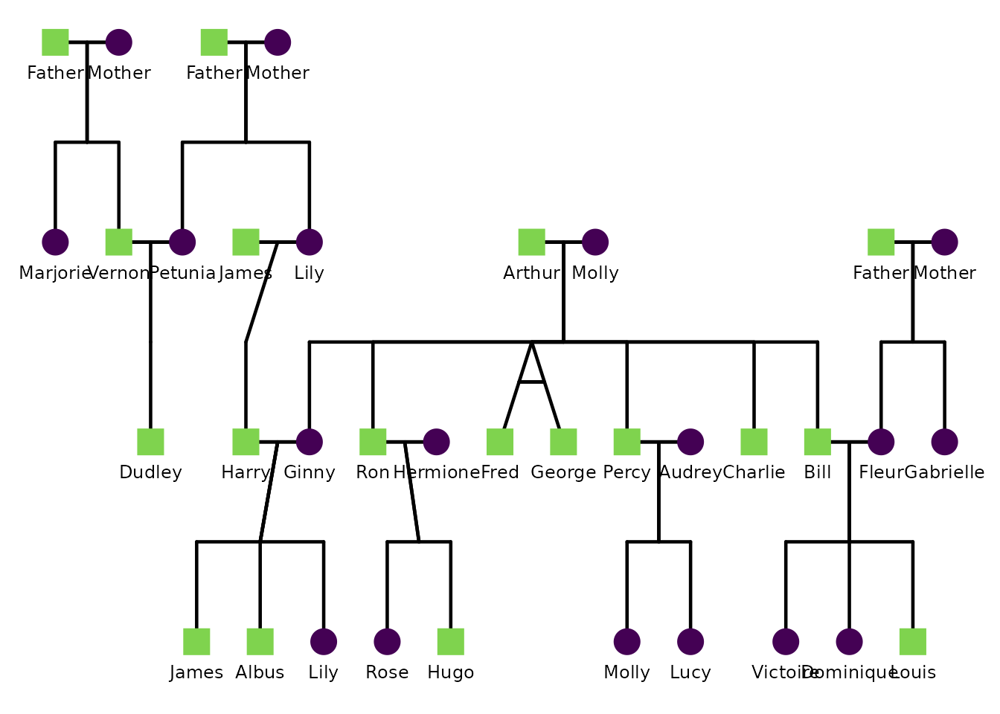

To turn labels off completely:

``` r

ggPedigree(
  potter,
  famID = "famID",
  personID = "personID",
  momID = "momID",
  dadID = "dadID",
  config = list(label_include = FALSE)
)
```

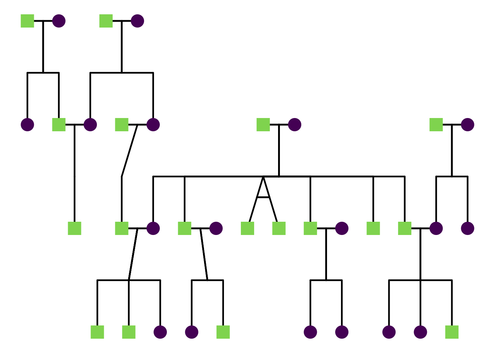

You can also use repelled labels to avoid overlaps:

``` r

ggPedigree(
  potter,
  famID = "famID",
  personID = "personID",
  momID = "momID",
  dadID = "dadID",
  config = list(
    label_include = TRUE,
    label_method = "geom_text_repel",
    label_max_overlaps = 10,
    label_text_size = 9,
    label_segment_color = "grey50"
  )
)
```

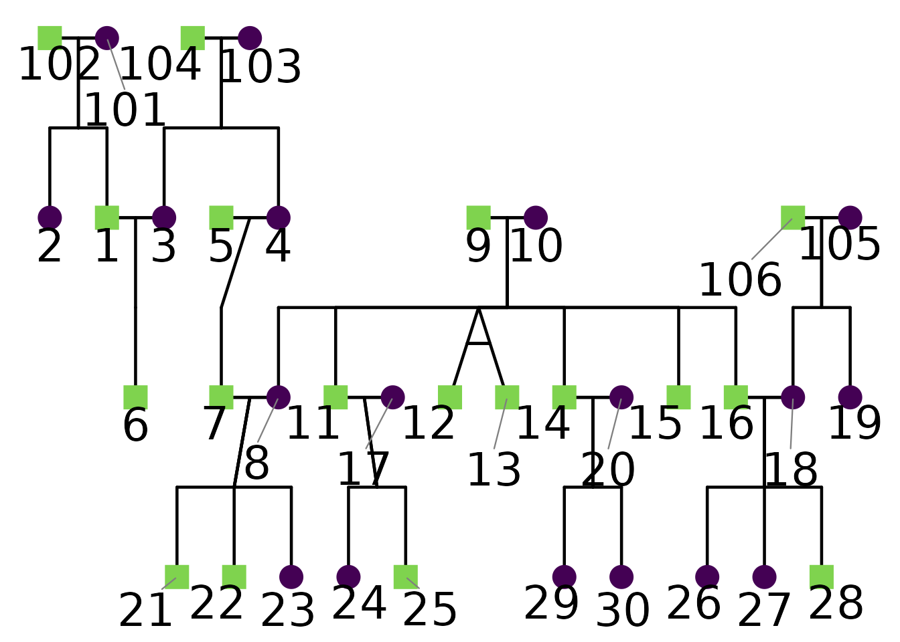

Note that short labels are less likely to overlap, so consider
abbreviating labels if your pedigree is dense. In this example, I
enlarged the text size to demonstrate repulsion more clearly. There is a
helper function called
[`renumberPedigreeIDs()`](https://r-computing-lab.github.io/ggpedigree/reference/dot-renumberPedigreeIDs.md)
that can be helpful in creating shorter IDs.

### 2) Points and outlines

Point size and whether points scale automatically are controlled by:

- `point_size`
- `point_scale_by_pedigree`

Outlines are controlled by:

- `outline_include`
- `outline_multiplier`
- `outline_color`
- `outline_alpha`

This example disables automatic point scaling and adds black outlines to
points.

``` r

ggPedigree(
  potter,
  famID = "famID",
  personID = "personID",
  momID = "momID",
  dadID = "dadID",
  config = list(
    point_scale_by_pedigree = FALSE,
    point_size = 6,
    outline_include = TRUE,
    outline_color = "maroon",
    outline_multiplier = 1.5,
    outline_alpha = 1
  )
)
```

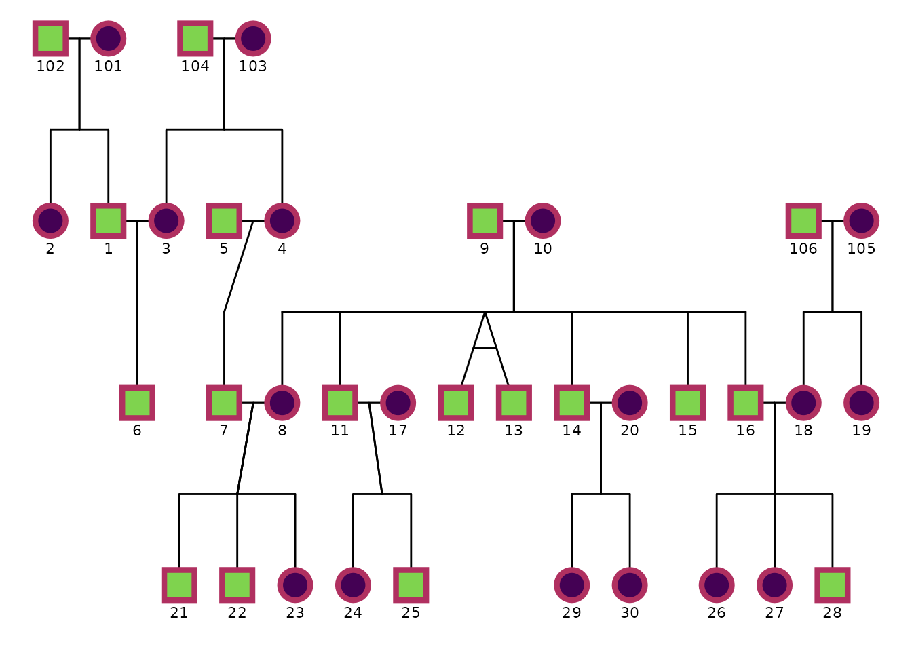

### 3) Segments (relationships)

Segments are controlled by options such as:

- `segment_linewidth`, `segment_linetype`
- `segment_offspring_color`, `segment_parent_color`,
  `segment_spouse_color`
- `segment_self_*` for self-loops
- `segment_mz_*` for MZ twin segments

This example thickens relationship segments and changes the spouse
segment color.

``` r

ggPedigree(
  potter,
  famID = "famID",
  personID = "personID",
  momID = "momID",
  dadID = "dadID",
  config = list(
    segment_linewidth = 2,
    segment_spouse_color = "steelblue",
    segment_parent_color = "black",
    segment_offspring_color = "black"
  )
)
```

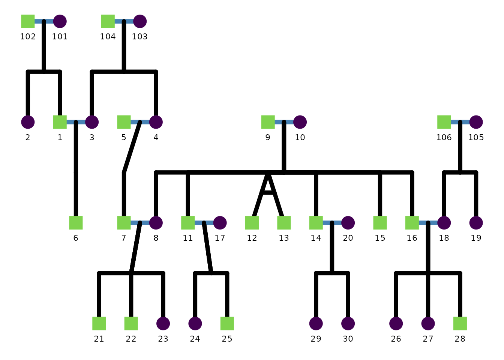

Self-loop geometry is also configurable:

``` r

ggPedigree(
  inbreeding %>% filter(famID %in% 5),
  famID = "famID",
  personID = "ID",
  momID = "momID",
  dadID = "dadID",
  config = list(
    segment_self_linetype = "dotdash",
    segment_self_color = "hotpink",
    segment_self_alpha = 0.6,
    segment_self_linewidth = 1.5,
    segment_self_curvature = -0.2,
    segment_self_angle = 80,
    code_male = 0
  )
) + ggtitle("Custom self-loop appearance")
```

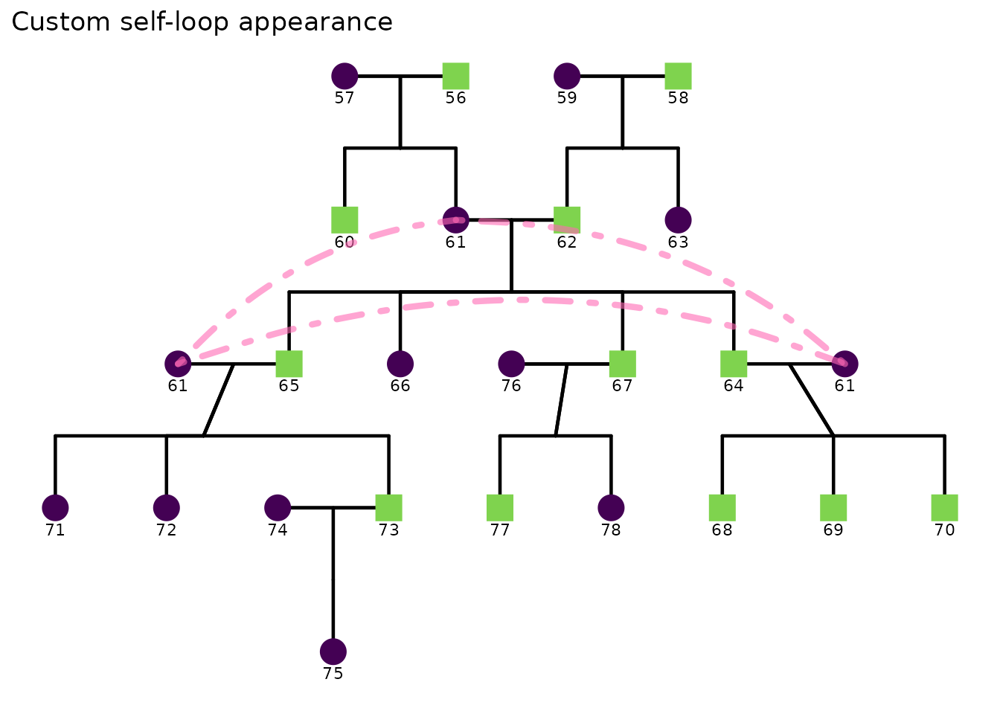

### 4) Sex appearance

Sex is controlled by settings such as:

- `sex_color_include`
- `sex_color_palette`
- `sex_shape_female`, `sex_shape_male`, `sex_shape_unknown`
- `sex_legend_show`, `sex_legend_title`

This example shows the sex legend and customizes shapes.

Here I use shapes 17 (triangle) for males, 18 (diamond) for females, and
16 (circle) for unknown. You can find a full list of shape codes in the
`pch` documentation
([`?points`](https://rdrr.io/r/graphics/points.html)). You can also use
shapes from the `ggplot2` shape palette (e.g., 21-25 for filled shapes).
Here I also disable sex coloring to focus on shapes alone.

``` r

ggPedigree(
  potter,
  famID = "famID",
  personID = "personID",
  momID = "momID",
  dadID = "dadID",
  config = list(
    sex_legend_show = TRUE,
    sex_shape_female = 18,
    sex_shape_male = 17,
    sex_shape_unknown = 16,
    sex_color_include = FALSE
  )
)
```

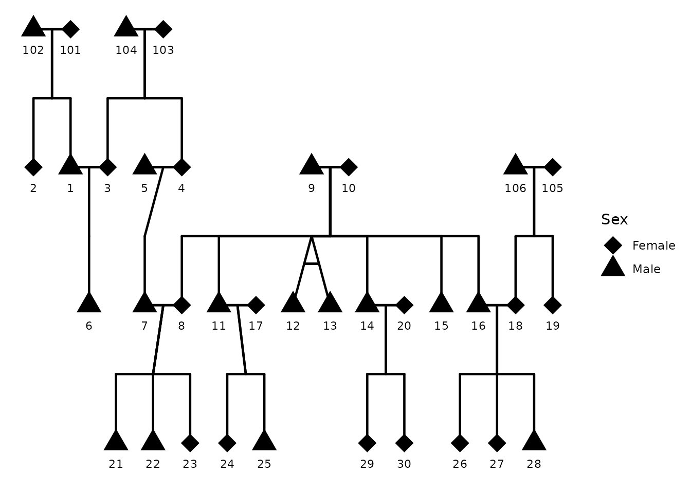

Below, I use a custom color palette for sex as well as emoji shapes for
fun.

``` r

plot_ped <- ggPedigree(
  potter,
  famID = "famID",
  personID = "personID",
  momID = "momID",
  dadID = "dadID",
  config = list(
    sex_color_palette = c("purple", "orange", "grey50"),
    sex_shape_female = "🥰",
    sex_shape_male = "🚗"
  )
)

ggplot2::ggsave(
  filename = "custom_sex_emoji_pedigree.png",
  plot = plot_ped,
  width = 8,
  height = 6,
  dpi = 300
)
```

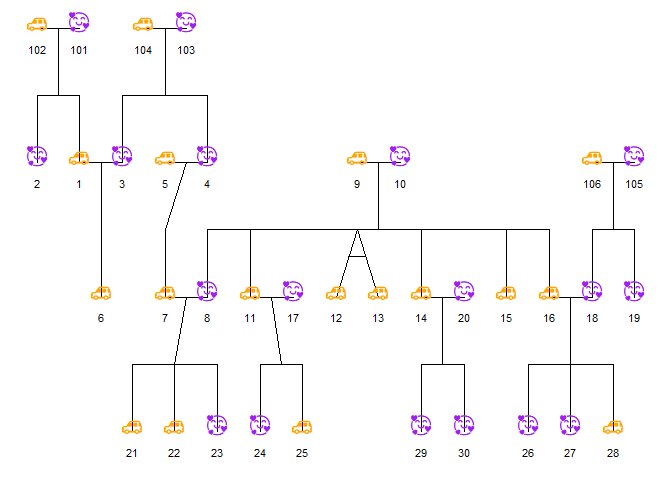

Note that when using emoji shapes, it is best to use
[`ggsave()`](https://ggplot2.tidyverse.org/reference/ggsave.html) to
save the plot to a file, as some R graphics devices may render emoji
differently. Notice how the emoji shapes appear in the saved PNG file
below compares to the image rendered during the preview above. These
images may vary because of differences in font rendering.

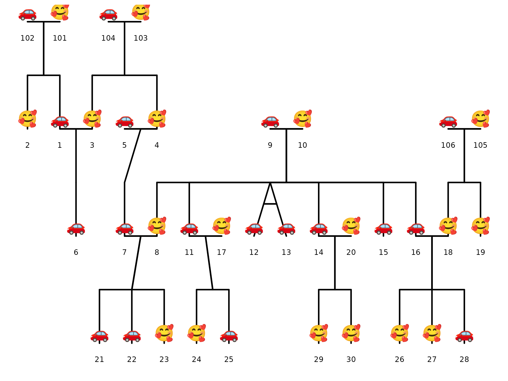

### 5) Affected status overlay

Affected status behavior is controlled by config keys such as:

- `status_include`
- `status_code_affected`, `status_code_unaffected`
- `status_alpha_affected`, `status_alpha_unaffected`
- `status_color_affected`, `status_color_unaffected`
- `status_legend_show`

If your dataset includes an affected status column, you can control how
affected status is drawn.

Below is a template showing the relevant config keys. Here I use the
`hazard` dataset from
[BGmisc](https://github.com/R-Computing-Lab/BGmisc/). The `affected`
column uses 1 for affected and 0 for unaffected.

``` r

ggPedigree(
  hazard,
  famID = "famID",
  personID = "ID",
  momID = "momID",
  dadID = "dadID",
  status_column = "affected",
  config = list(
    code_male = 0,
    status_include = TRUE,
    status_code_affected = 1,
    status_code_unaffected = 0,
    status_alpha_affected = .6,
    status_alpha_unaffected = 0,
    status_color_affected = "red",
    status_shape_affected = 8,
    status_legend_show = TRUE
  )
)
```

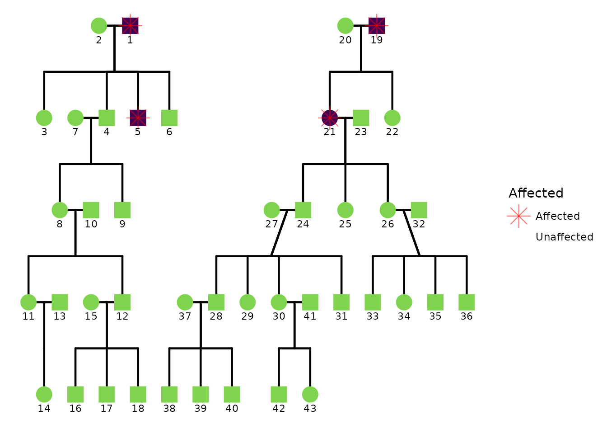

#### Multiple overlays with per-overlay customization

When a single status marker is not enough, you can pass a **list of
overlay specs** to the `overlays` argument. Each element of the list is
itself a list that names a column and optionally overrides any overlay
config key — `shape`, `color`, `stroke`, `size`, and `code_affected` —
for that layer only. Config defaults are used for any key you leave out.

The `hazard` dataset already contains `deathYr` and `onsetYr`, which map
naturally onto two independent overlays — deceased individuals (a cross)
and those with a recorded disease onset (a slash):

``` r

# Derive binary flags from columns already present in hazard
hazard$deceased <- ifelse(!is.na(hazard$deathYr), 1, 0)
hazard$onset <- ifelse(!is.na(hazard$onsetYr), 1, 0)

ggPedigree(
  hazard,
  famID = "famID",
  personID = "ID",
  momID = "momID",
  dadID = "dadID",
  overlays = list(
    list(column = "deceased", code_affected = 1, shape = "cross", color = "purple"),
    list(column = "onset", code_affected = 1, shape = "slash", color = "red", stroke = 2)
  ),
  config = list(
    code_male = 0,
    overlay_include = TRUE,
    overlay_mode = "shape",
    reduce_variables = F,
    sex_color_include = FALSE
  )
)
```

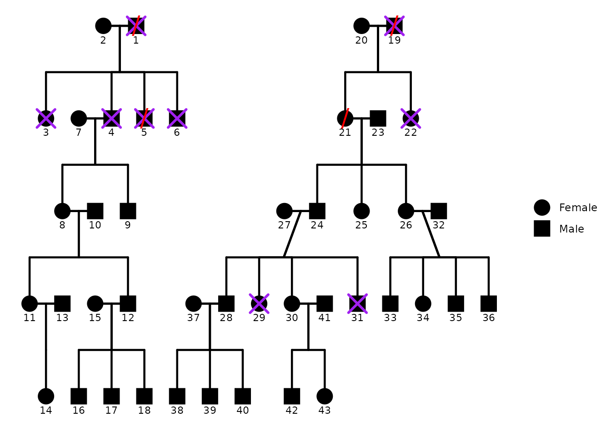

A few things to note:

- **`overlay_mode = "shape"`** must be set in `config` (or via a preset
  such as `"clinical"`) to activate shape-based rendering. Without it
  the overlay loop falls back to alpha transparency.
- Each spec can carry any combination of per-layer overrides. Specs with
  no override for a key inherit the matching `config$overlay_*` default,
  so you only need to specify what differs.
- The specs are rendered as separate
  [`geom_point()`](https://ggplot2.tidyverse.org/reference/geom_point.html)
  layers in list order, so later specs draw on top of earlier ones for
  individuals who satisfy both conditions.

This means that when we have multiple conditions to show, they can be
layered on top of each other with different shapes and colors. In the
example above, we have two overlays: one for deceased individuals (a
purple cross) and another for disease onset (a red slash). Individuals
who are both deceased and have a recorded disease onset will have both
shapes drawn on top of their node, allowing us to visually distinguish
between different combinations of conditions.

Building on the previous example, we can also leverage other config
options to further customize the plot. For instance we can facet by
family ID to separate the pedigrees, and we can add labels for maternal
IDs with custom colors. Here I use
[`ped2maternal()`](https://r-computing-lab.github.io/BGmisc/reference/ped2maternal.html)
to add a `matID` column to the `hazard` dataset, which identifies each
individual’s maternal lineage. Then I use
[`geom_text()`](https://ggplot2.tidyverse.org/reference/geom_text.html)
to label each individual with their `matID`, coloring the labels
randomly in grey or black for visual interest.

``` r

hazard <- ped2maternal(hazard,
  famID = "famID",
  personID = "ID",
  momID = "momID",
  dadID = "dadID"
)
hazard$label_color <- sample(c("grey", "black"), nrow(hazard), replace = TRUE)


ggPedigree(
  hazard,
  famID = "famID",
  personID = "ID",
  momID = "momID",
  dadID = "dadID",
  overlays = list(
    list(column = "deceased", code_affected = 1, shape = "cross", color = "purple"),
    list(column = "onset", code_affected = 1, shape = "slash", color = "red", stroke = 2)
  ),
  config = list(
    code_male = 0,
    overlay_include = TRUE,
    overlay_mode = "shape",
    reduce_variables = F,
    sex_color_palette = c("steelblue", "salmon", "grey50")
  )
) +
  facet_wrap(~famID,
    scales = "free_x"
  ) +
  geom_text(aes(label = matID),
    color = hazard$label_color,
    nudge_x = 0.15,
    nudge_y = 0.15, size = 3
  )
#> Warning: Removed 4 rows containing missing values or values outside the scale range
#> (`geom_text()`).
```

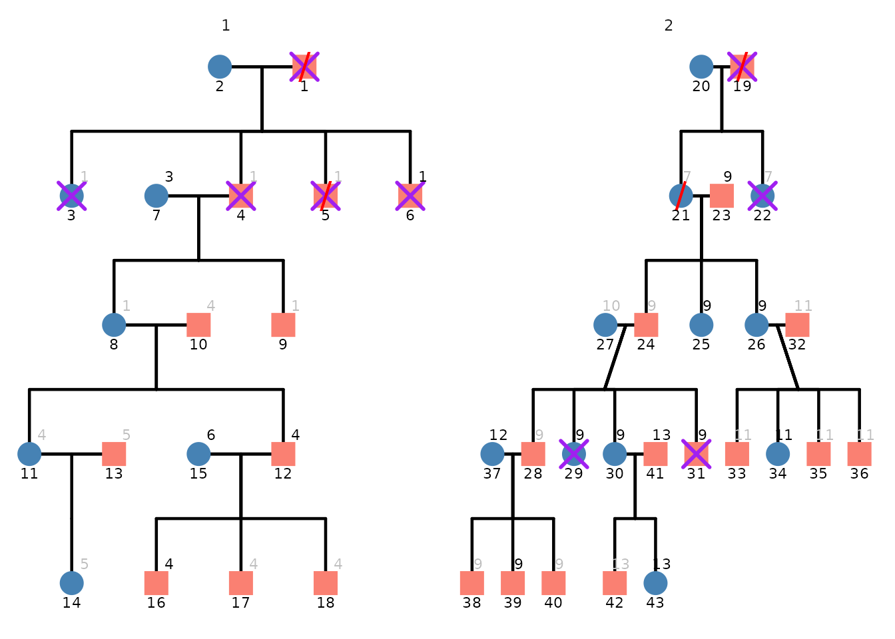

If you want to use standard `ggplot2` geoms such as
[`geom_text()`](https://ggplot2.tidyverse.org/reference/geom_text.html)
to add labels, I recommend setting `reduce_variables = FALSE` in
`config` to prevent the automatic reduction of variables. This allows
you to retain the all the columns for labeling and faceting. In this
example, we use
[`geom_text()`](https://ggplot2.tidyverse.org/reference/geom_text.html)
to label each individual with their `matID`, and we color the labels
randomly in grey or black for visual interest.

To illustrate the effect of `reduce_variables`, let us facet by
generation instead of family ID. With `reduce_variables = FALSE`, the
black segments connecting individuals follow the nodes to the correct
panel. In contrast, when `reduce_variables = TRUE`, the segments are
drawn on all the panels because the generation variable isn’t present in
the dataframe used for segment drawing.

``` r

ggPedigree(
  hazard,
  famID = "famID",
  personID = "ID",
  momID = "momID",
  dadID = "dadID",
  overlays = list(
    list(column = "deceased", code_affected = 1, shape = "cross", color = "purple"),
    list(column = "onset", code_affected = 1, shape = "slash", color = "red", stroke = 2)
  ),
  config = list(
    code_male = 0,
    overlay_include = TRUE,
    overlay_mode = "shape",
    reduce_variables = F,
    sex_color_palette = c("steelblue", "salmon", "grey50")
  )
) +
  facet_wrap(~gen,
    scales = "free_x"
  )
```

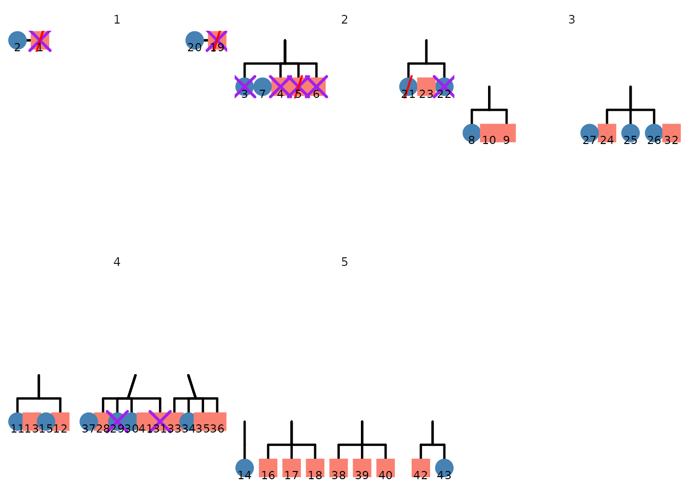

``` r


ggPedigree(
  hazard,
  famID = "famID",
  personID = "ID",
  momID = "momID",
  dadID = "dadID",
  overlays = list(
    list(column = "deceased", code_affected = 1, shape = "cross", color = "purple"),
    list(column = "onset", code_affected = 1, shape = "slash", color = "red", stroke = 2)
  ),
  config = list(
    code_male = 0,
    overlay_include = TRUE,
    overlay_mode = "shape",
    reduce_variables = T,
    sex_color_palette = c("steelblue", "salmon", "grey50")
  )
) +
  facet_wrap(~gen,
    scales = "free_x"
  )
```

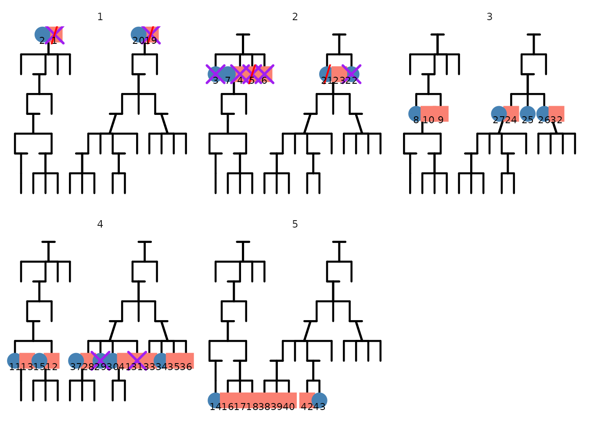

### 6) Focal fill: highlighting relatives of a focal individual

A common analysis task is to pick a focal individual and visually
emphasize how strongly other individuals are related to that focal
person. In [ggpedigree](https://github.com/R-Computing-Lab/ggpedigree/),
this is handled by **focal fill**. When focal fill is enabled, node fill
colors are mapped to a focal-based value (for example additive genetic
relatedness or another focal-derived scalar).

Focal fill is controlled entirely through `config`. The minimal
ingredients are:

- `focal_fill_include = TRUE`
- `focal_fill_personID = <ID of focal person>`
- `focal_fill_component = <component to use for focal calculation>`. It
  can be `"additive"` (default), `"mitochondrial"`, `"patID"`, or
  `"matID"`.
- `focal_fill_method` is the Method used for focal fill gradient.
  Options are ‘steps’, ‘steps2’, ‘step’, ‘step2’, ‘viridis_c’,
  ‘viridis_d’, ‘viridis_b’, ‘manual’, ‘hue’, ‘gradient2’, ‘gradient’.

#### Turning focal fill on

Below we choose an individual as the focal person, enable focal fill,
and disable sex coloring to highlight the focal fill pattern clearly.
The exact person identifier must match the `personID` column used in the
plot.

``` r

ggPedigree(
  potter,
  famID = "famID",
  personID = "personID",
  momID = "momID",
  dadID = "dadID",
  config = list(
    focal_fill_include = TRUE,
    sex_color_include = FALSE,
    focal_fill_component = "additive",
    focal_fill_personID = 8,
    focal_fill_legend_show = TRUE,
    focal_fill_legend_title = "Focal relatedness"
  )
)
```


If the plot is dense, it is often helpful to turn labels off or reduce
their prominence, so the focal fill pattern reads cleanly. Note we can
also choose different focal components such as `"mitochondrial"`, which
traces matrilineal relatedness.

``` r

ggPedigree(
  potter,
  famID = "famID",
  personID = "personID",
  momID = "momID",
  dadID = "dadID",
  config = list(
    focal_fill_include = TRUE,
    sex_color_include = FALSE,
    focal_fill_personID = 8,
    focal_fill_component = "mitochondrial",
    label_include = FALSE,
    point_scale_by_pedigree = FALSE,
    point_size = 6
  )
)
```

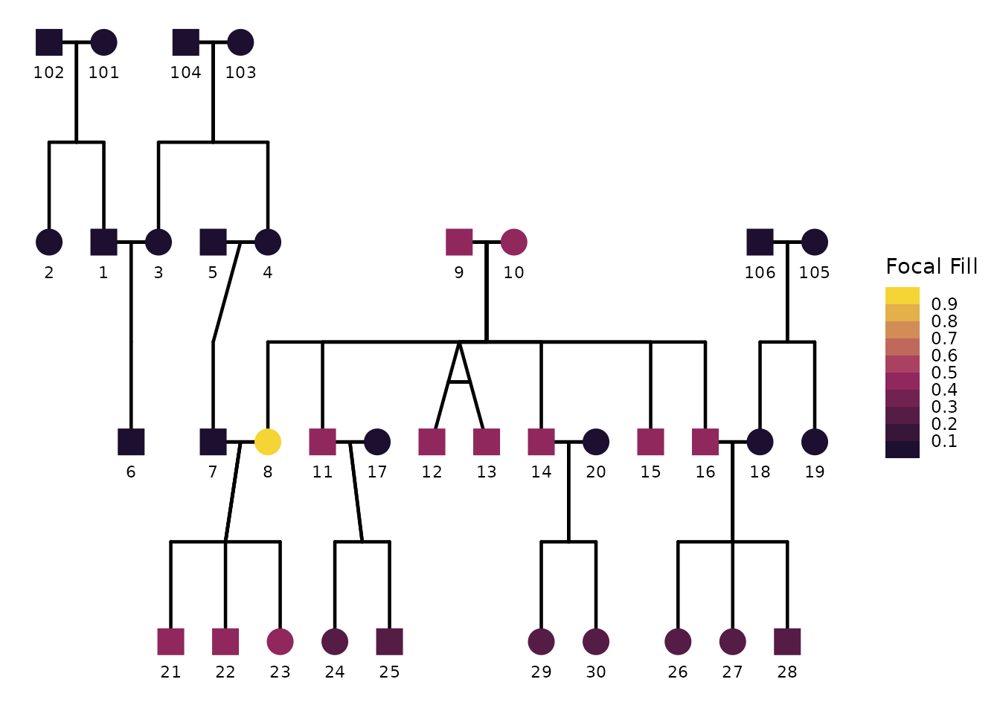

#### Choosing the focal fill scale and colors

Focal fill supports multiple scale methods via `focal_fill_method`. For
continuous gradients, the most common choice is `"gradient"` (default)
or `"gradient2"`.

You can explicitly set the low/mid/high colors used by the focal
gradient:

``` r

ggPedigree(
  potter,
  famID = "famID",
  personID = "personID",
  momID = "momID",
  dadID = "dadID",
  config = list(
    focal_fill_include = TRUE,
    sex_color_include = FALSE,
    focal_fill_personID = 8,
    focal_fill_method = "gradient2",
    focal_fill_low_color = "purple",
    focal_fill_mid_color = "orange",
    focal_fill_high_color = "red",
    focal_fill_scale_midpoint = 0.10,
    focal_fill_legend_show = TRUE
  )
)
```

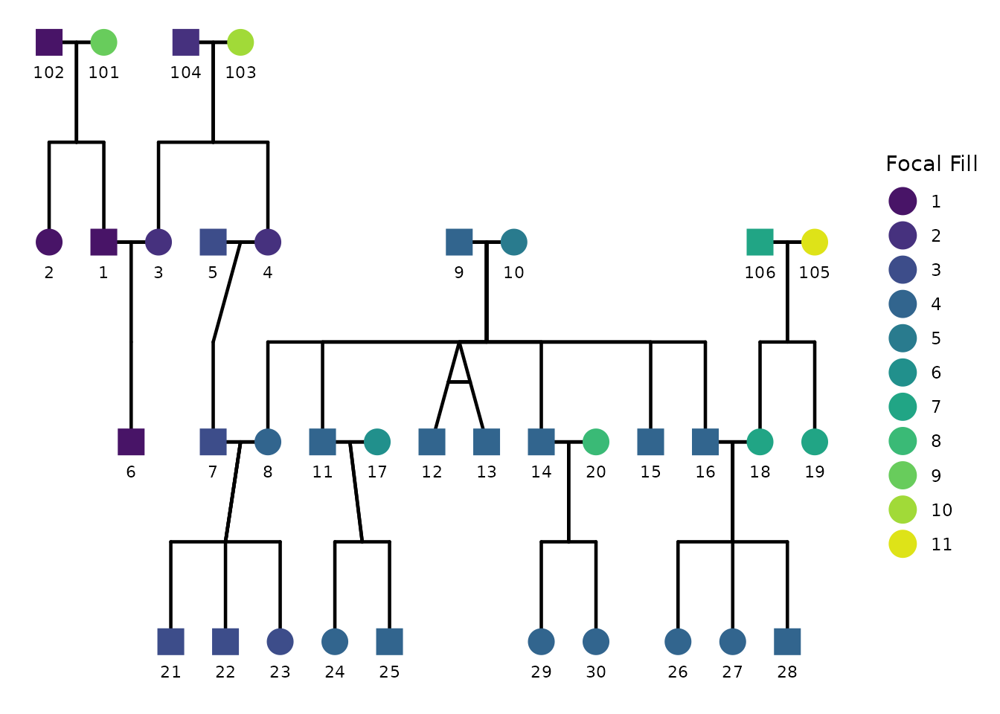

#### Discrete focal fill palettes

If you prefer discrete bins rather than a continuous gradient, you can
use step-based scales (for example `"steps"` / `"steps2"`). When using
step-based methods, `focal_fill_n_breaks` controls the number of
discrete breaks.

``` r

ggPedigree(
  potter,
  famID = "famID",
  personID = "personID",
  momID = "momID",
  dadID = "dadID",
  config = list(
    focal_fill_include = TRUE,
    sex_color_include = FALSE,
    focal_fill_personID = 8,
    focal_fill_method = "steps2",
    focal_fill_n_breaks = 9,
    focal_fill_legend_show = TRUE
  )
)
```


#### Handling missing and zero values

When focal fill is computed, some individuals can have missing focal
values (for example if they are disconnected). You can control the color
used for missing values with `focal_fill_na_color`. The
`focal_fill_force_zero` option forces exact zeros to be treated as
missing so they can be filled in using `focal_fill_na_color`.

``` r

ggPedigree(
  potter,
  famID = "famID",
  personID = "personID",
  momID = "momID",
  dadID = "dadID",
  config = list(
    focal_fill_include = TRUE,
    sex_color_include = FALSE,
    focal_fill_personID = 4,
    focal_fill_force_zero = TRUE,
    focal_fill_na_color = "grey75"
  )
)
```

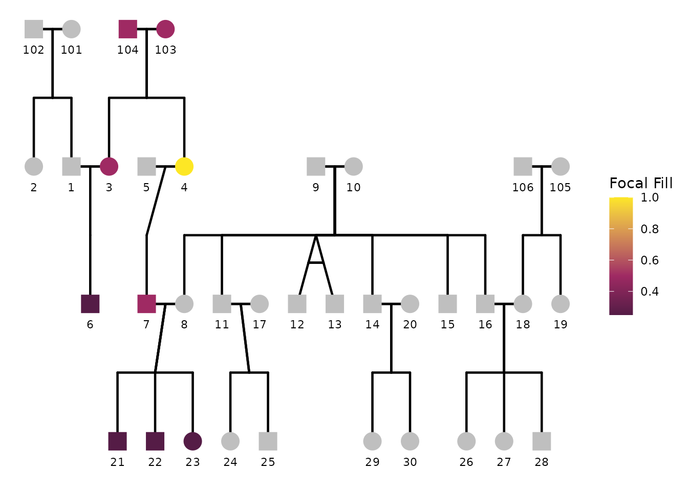

#### Using viridis-based focal fill

If you want perceptually uniform color scaling, focal fill supports
viridis options through `focal_fill_method = "viridis_c"` (continuous)
or `"viridis_d"` (discrete). You can control the viridis option and
range using:

- `focal_fill_viridis_option`
- `focal_fill_viridis_begin`
- `focal_fill_viridis_end`
- `focal_fill_viridis_direction`

Here the focal fill is drawn using paternal relatedness. Each
individual’s fill color indicates which patriline they belong to,
colored using a discrete viridis palette.

``` r

ggPedigree(
  potter,
  famID = "famID",
  personID = "personID",
  momID = "momID",
  dadID = "dadID",
  config = list(
    focal_fill_include = TRUE,
    sex_color_include = FALSE,
    focal_fill_personID = 5,
    focal_fill_method = "viridis_d",
    focal_fill_component = "patID",
    focal_fill_viridis_option = "D",
    focal_fill_viridis_begin = 0.05,
    focal_fill_viridis_end = 0.95,
    focal_fill_viridis_direction = 1,
    focal_fill_legend_show = TRUE
  )
)
```


### 7) Lineage-colored segments: tracing family lines

Focal fill (Section 6) colors the **nodes**. You can instead—or
additionally—color the **connecting segments** by family lineage, which
makes it easy to trace a paternal line, a maternal line, or a
mitochondrial (matrilineal) line through the tree.

This is controlled by the `segment_lineage_*` options. The minimal
ingredients are:

- `segment_lineage_include = TRUE`
- `segment_lineage_component = <line to trace>`. Uses the same
  vocabulary as focal fill: `"mitochondrial"` / `"mtdna"`, `"maternal"`,
  `"paternal"`, `"family"`, `"additive"`, or `"common nuclear"`.
- `segment_lineage_focal_personID = <ID>` (optional). When supplied,
  segments are colored by their relationship *to that focal person*, so
  off-line segments fade to grey and only the lines connected to that
  individual are highlighted.

Each segment inherits the lineage value of the person it is anchored to,
so the coloring is unambiguous even where a spouse link bridges two
different lines.

#### Coloring every line

With no focal person, each lineage group gets its own color. Here every
matriline (mitochondrial line) is drawn in a distinct color. We disable
sex coloring so the segment colors read cleanly.

``` r

ggPedigree(
  potter,
  famID = "famID",
  personID = "personID",
  momID = "momID",
  dadID = "dadID",
  config = list(
    sex_color_include = FALSE,
    focal_fill_include = FALSE,
    segment_lineage_include = TRUE,
    segment_lineage_component = "mitochondrial",
    segment_lineage_legend_title = "Matriline"
  )
)
```

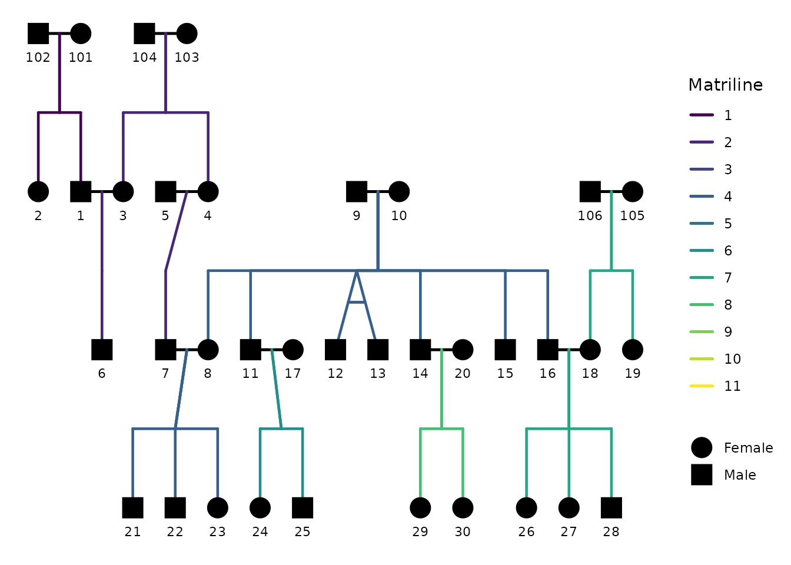

Switching `segment_lineage_component` to `"paternal"` traces the
patrilines instead—useful for following surname lines.

``` r

ggPedigree(
  potter,
  famID = "famID",
  personID = "personID",
  momID = "momID",
  dadID = "dadID",
  config = list(
    sex_color_include = FALSE,
    focal_fill_include = FALSE,
    segment_lineage_include = TRUE,
    segment_lineage_component = "paternal",
    segment_lineage_legend_title = "Patriline"
  )
)
```

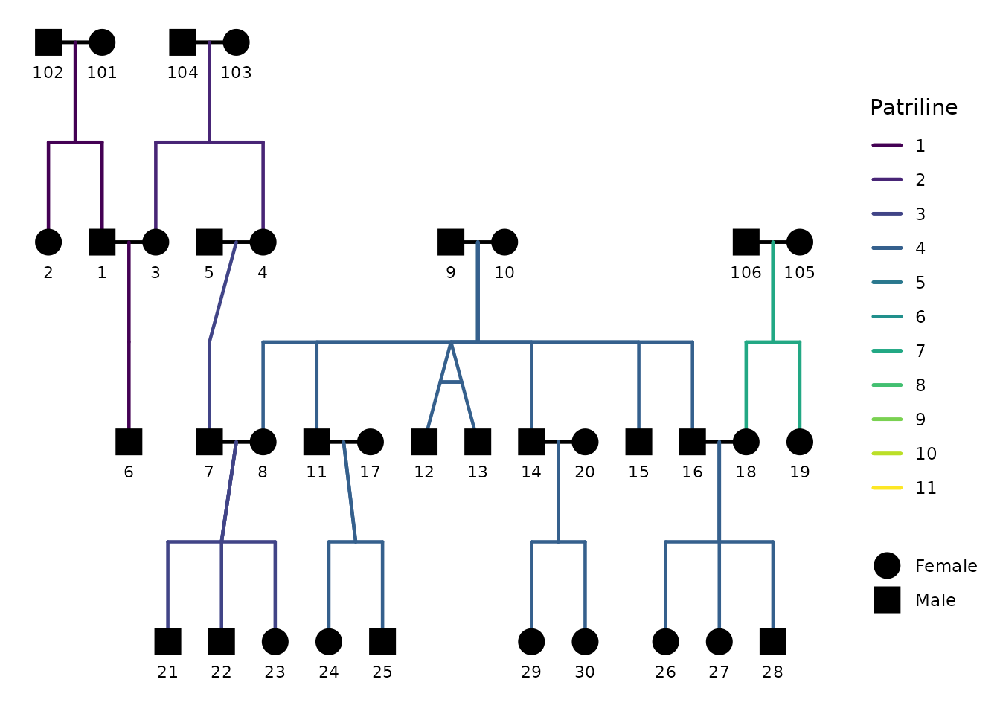

#### Tracing the lines connected to one person

Supply `segment_lineage_focal_personID` to highlight only the lineage
that runs through a chosen individual. With the mitochondrial component,
this lights up that person’s matrilineal chain and greys out everything
else.

``` r

ggPedigree(
  potter,
  famID = "famID",
  personID = "personID",
  momID = "momID",
  dadID = "dadID",
  config = list(
    sex_color_include = FALSE,
    focal_fill_include = FALSE,
    segment_lineage_include = TRUE,
    segment_lineage_component = "mitochondrial",
    segment_lineage_focal_personID = 8,
    segment_lineage_method = "viridis_c",
    segment_lineage_na_color = "grey85"
  )
)
```

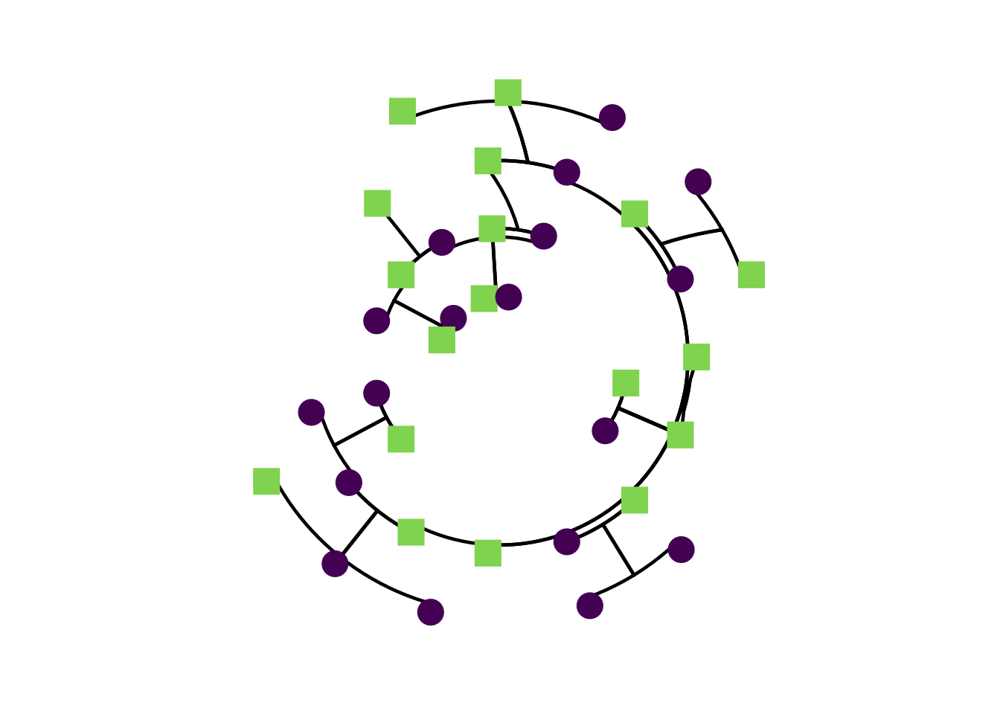

#### Choosing which segments participate

By default the inheritance-bearing segments are colored
(`segment_lineage_types = c("parent", "offspring", "sibling", "mz")`).
You can broaden or narrow this—for example, add `"spouse"` to also color
spouse links, or restrict to just the parent stubs.

``` r

ggPedigree(
  potter,
  famID = "famID",
  personID = "personID",
  momID = "momID",
  dadID = "dadID",
  config = list(
    sex_color_include = FALSE,
    focal_fill_include = FALSE,
    segment_lineage_include = TRUE,
    segment_lineage_component = "paternal",
    segment_lineage_types = c("parent", "offspring", "sibling", "mz", "spouse")
  )
)
```

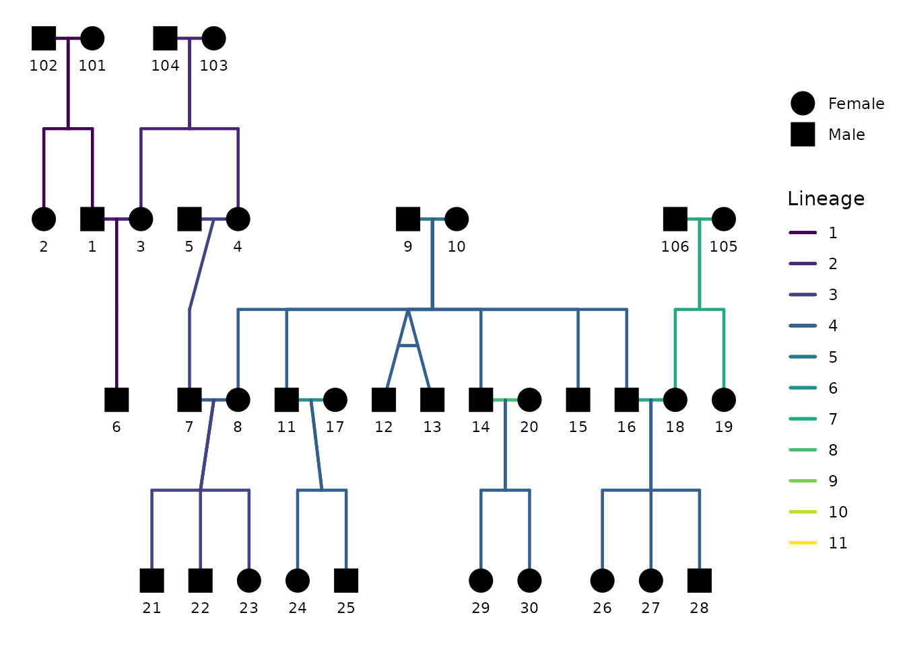

#### Combining node focal fill with segment lineage

The most expressive use is to color **nodes by focal relatedness** and
**segments by lineage** at the same time. Because nodes and segments
then need two independent color scales, this requires the suggested
[`ggnewscale`](https://cran.r-project.org/package=ggnewscale) package.
If it is not installed, the segments fall back to their fixed colors
with a warning.

``` r

ggPedigree(
  potter,
  famID = "famID",
  personID = "personID",
  momID = "momID",
  dadID = "dadID",
  config = list(
    sex_color_include = FALSE,
    # nodes: additive relatedness to the focal person
    focal_fill_include = TRUE,
    focal_fill_component = "additive",
    focal_fill_personID = 8,
    focal_fill_legend_title = "Relatedness",
    # segments: paternal line membership
    segment_lineage_include = TRUE,
    segment_lineage_component = "paternal",
    segment_lineage_legend_title = "Patriline"
  )
)
```

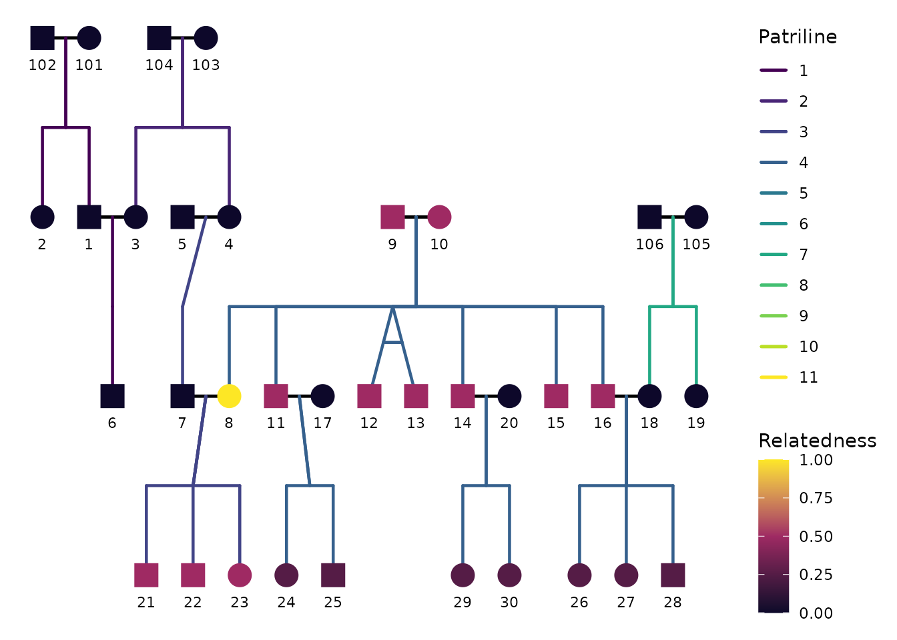

> **Interactive plots.** The combined node + segment coloring relies on
> `ggnewscale`, whose second color scale does not convert to `plotly`.
> In
> [`ggPedigreeInteractive()`](https://r-computing-lab.github.io/ggpedigree/reference/ggPedigreeInteractive.md),
> single-scale lineage coloring (segments only, nodes uncolored) works
> as shown above; if you also enable node coloring, the interactive plot
> warns and falls back to fixed segment colors. Use the static
> [`ggPedigree()`](https://r-computing-lab.github.io/ggpedigree/reference/ggPedigree.md)
> for the combined view.

### 8) Global greyscale / black-and-white switch

If you want a black-and-white plot, you can request it using:

- `color_theme = "greyscale"` (also accepts `"bw"`, `"black"`, etc.)

This triggers coordinated adjustments so the plot remains coherent
without manually changing multiple palettes.

``` r

ggPedigree(
  potter,
  famID = "famID",
  personID = "personID",
  momID = "momID",
  dadID = "dadID",
  config = list(
    color_theme = "bw",
    focal_fill_include = TRUE,
    sex_color_include = FALSE,
    focal_fill_personID = 5,
    segment_linewidth = 0.7,
    point_scale_by_pedigree = FALSE,
    point_size = 6
  )
)
```

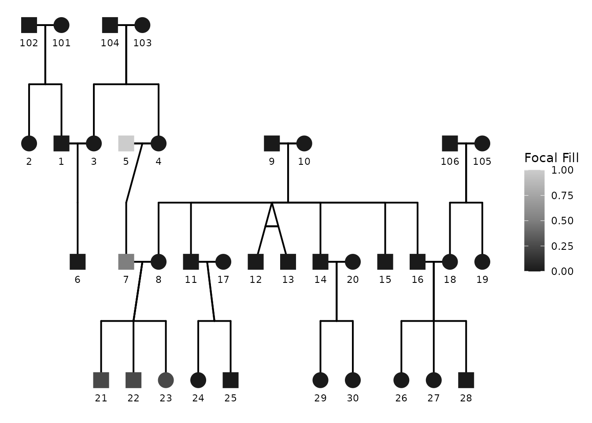

### 9) Interactive pedigrees: `ggPedigreeInteractive()`

Interactive pedigrees usually require thinner segments and careful
tooltip selection. Tooltips are controlled primarily through
`tooltip_columns`, while most drawing options are still handled by
`config`.

``` r

ggPedigreeInteractive(
  potter,
  famID = "famID",
  personID = "personID",
  momID = "momID",
  dadID = "dadID",
  tooltip_columns = c("personID", "first_name", "sex"),
  config = list(
    label_include = FALSE,
    point_scale_by_pedigree = FALSE,
    point_size = 7,
    segment_linewidth = 0.5,
    sex_color_include = FALSE,
    # nodes: additive relatedness to the focal person
    focal_fill_include = TRUE,
    focal_fill_component = "additive",
    focal_fill_personID = 8,
    focal_fill_legend_title = "Relatedness"
  )
)
```

### 10) Layout and coordinate system

In addition to the above options, layout and coordinate system are also
configurable via `config`. For example if you are interested in a
circular layout, you can set `coord_layout = "radial"` and adjust the
minimum radius with `coord_radial_min_radius`. This plot uses polar
coordinates to create a circular pedigree layout.

``` r

ggPedigree(
  potter,
  famID = "famID",
  personID = "personID",
  momID = "momID",
  dadID = "dadID",
  config = list(
    coord_layout = "radial",
    point_scale_by_pedigree = FALSE,
    coord_radial_min_radius = 1,
    label_include = FALSE,
    spread_out_generations_factor = 12.5,
    spread_out_generations = TRUE
  )
) #+theme_classic()
```


### 11) Pinning individuals to fixed positions

Normally the horizontal position of each person is decided by the layout
engine. If you want to override that for specific individuals—to slide
one person to a particular spot, separate two overlapping branches, or
line up a person with a feature elsewhere in the plot—use
`fixed_positions`.

`fixed_positions` is a data frame with an ID column (named to match your
`personID`) plus an `x` and/or `y` column. Each row pins that person to
an absolute position. A missing or `NA` entry leaves that axis as
computed.

Positions are given in **raw layout-slot units**: the same units
[`calculateCoordinates()`](https://r-computing-lab.github.io/ggpedigree/reference/calculateCoordinates.md)
produces, *before* `generation_width`/`generation_height` scaling and
any radial transform. The easiest way to discover sensible values is to
inspect the computed layout first:

``` r

coords <- calculateCoordinates(
  potter,
  personID = "personID", momID = "momID", dadID = "dadID"
)
head(coords[, c("personID", "x_pos", "y_pos")])
#>   personID x_pos y_pos
#> 1        1   1.0     2
#> 2        2   0.0     2
#> 3        3   2.0     2
#> 4        4   4.0     2
#> 5        5   3.0     2
#> 6        6   1.5     3
```

Here we pin one person far to the left of their generation. Because all
connecting segments are derived from these coordinates, the lines follow
the pinned node automatically—no other configuration needed.

``` r

ggPedigree(
  potter,
  famID = "famID",
  personID = "personID",
  momID = "momID",
  dadID = "dadID",
  config = list(
    fixed_positions = data.frame(
      personID = 8,
      x = -1.5
    )
  )
)
```

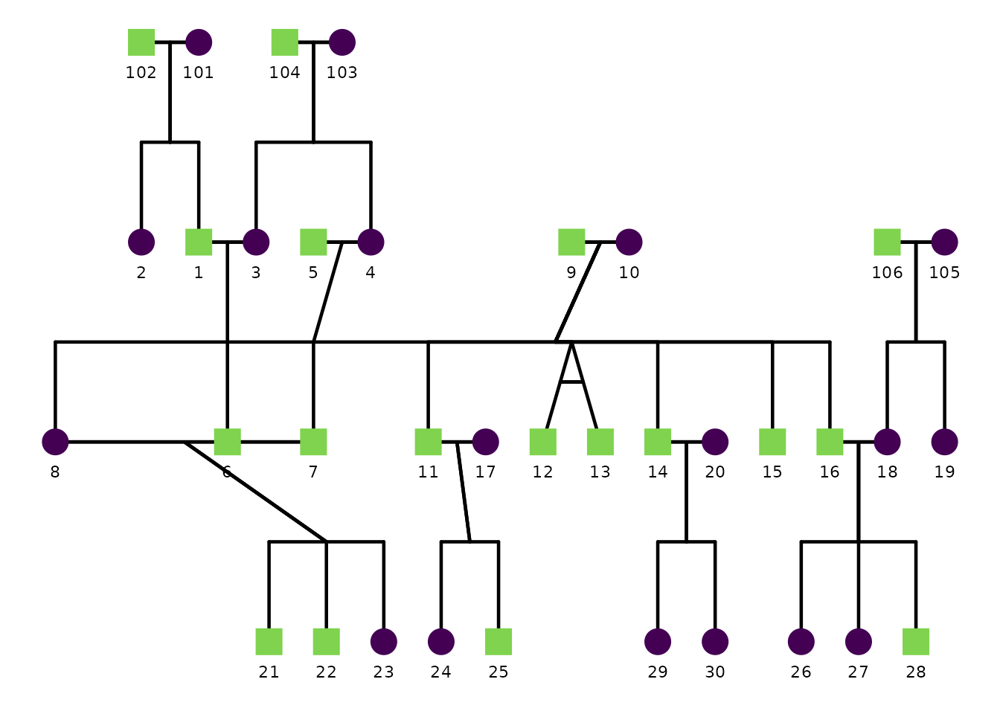

You can pin several people at once, and set `x`, `y`, or both. Use `NA`
to leave one axis untouched:

``` r

ggPedigree(
  potter,
  famID = "famID",
  personID = "personID",
  momID = "momID",
  dadID = "dadID",
  config = list(
    fixed_positions = data.frame(
      personID = c(106, 105),
      x = c(11, 13), # person 106 is shifted right; person 105 also shifts in x
      y = c(NA, 1.80) # person 106 keeps its generation; person 105 also shifts in y
    )
  )
)
```

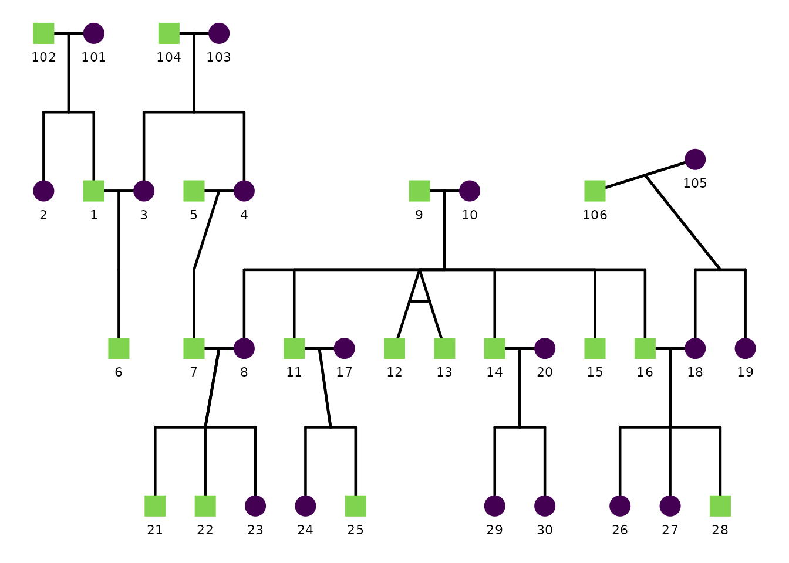

#### Pinning a parent

When you pin a **parent**, the connector running down to their children
is re-anchored to the pinned position by default, so it stays attached.
If you would rather move only the parent node and its spouse
link—leaving the child connector where it was—set
`fixed_positions_update_family = FALSE`.

``` r

ggPedigree(
  potter,
  famID = "famID",
  personID = "personID",
  momID = "momID",
  dadID = "dadID",
  config = list(
    fixed_positions = data.frame(personID = 101, x = 8, y = 1.5),
    fixed_positions_update_family = FALSE
  )
)
```

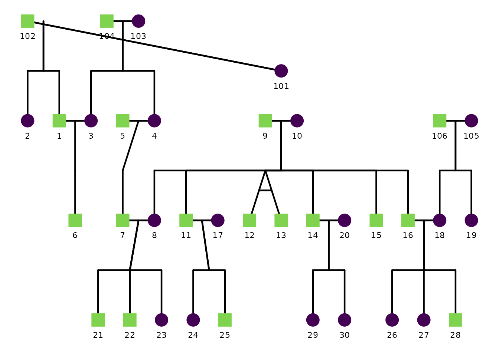

Pinning only repositions the people you name; everyone else stays where
the layout placed them, so it is up to you to choose positions that do
not overlap. IDs that are not found in the pedigree are ignored with a
warning.

### 12) Trying different founder orderings

#### Why row order matters

The layout engine (kinship2) processes individuals in the order they
appear in your data. For founders—people with no parents in the
pedigree—this row order determines their initial left-to-right
placement. Different orderings can move a couple from one side of the
tree to the other, shorten long diagonal connectors, or reduce visual
crossing of branches.

By default [ggpedigree](https://github.com/R-Computing-Lab/ggpedigree/)
does not shuffle the rows, so the layout is determined by whatever order
the data happen to arrive in. Two config options let you explore
alternatives:

| Option | Default | Purpose |
|----|----|----|
| `founder_order_seed` | `NULL` | Shuffle row order with this integer seed before layout |
| `founder_order_tries` | `1` | Try this many random shuffles; return the most compact one |

#### Comparing two layouts with `founder_order_seed`

The easiest way to explore is to try a few integer seeds and compare the
plots. Here we look at the default layout, seed 7, and seed 42 for the
`potter` pedigree.

``` r

p_default <- ggPedigree(
  potter,
  famID = "famID", personID = "personID",
  momID = "momID", dadID = "dadID",
  config = list(label_include = TRUE, label_text_size = 2.5)
) + ggplot2::ggtitle("Default ordering")

p_seed7 <- ggPedigree(
  potter,
  famID = "famID", personID = "personID",
  momID = "momID", dadID = "dadID",
  config = list(
    founder_order_seed = 7L,
    label_include = TRUE, label_text_size = 2.5
  )
) + ggplot2::ggtitle("founder_order_seed = 7")

p_seed42 <- ggPedigree(
  potter,
  famID = "famID", personID = "personID",
  momID = "momID", dadID = "dadID",
  config = list(
    founder_order_seed = 42L,
    label_include = TRUE, label_text_size = 2.5
  )
) + ggplot2::ggtitle("founder_order_seed = 42")
```

``` r

p_default
```

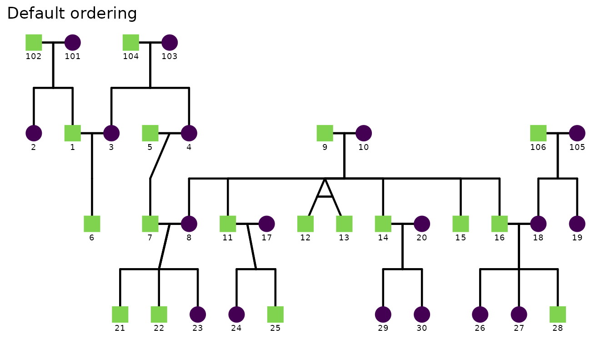

``` r

p_seed7
```

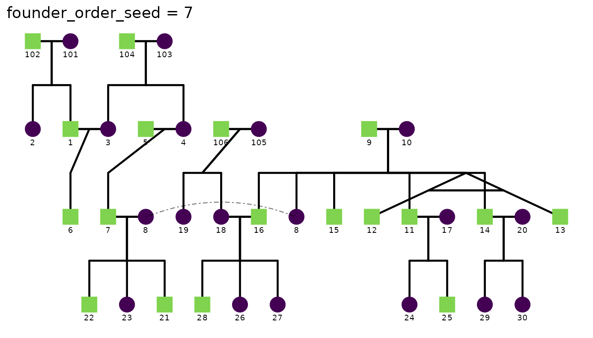

``` r

p_seed42
```

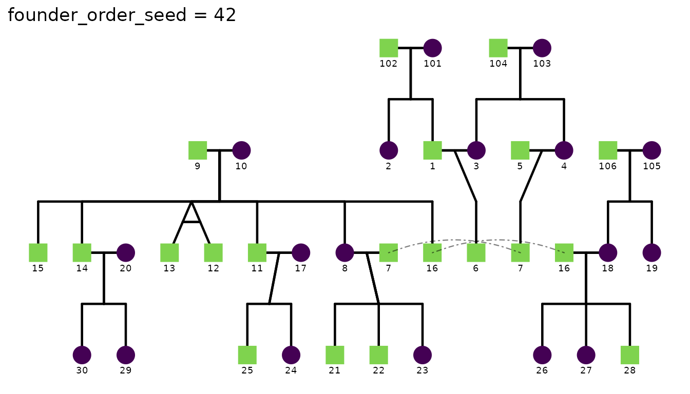

The same seed always produces the same plot, so results are fully
reproducible once you have chosen a preferred layout.

#### Measuring layout quality

[`calculateCoordinates()`](https://r-computing-lab.github.io/ggpedigree/reference/calculateCoordinates.md)
returns the raw layout data frame. You can compute a *layout score*
(total parent-stub offset — lower means children sit closer to the
midpoint of their parents) to compare candidates numerically before
plotting:

``` r

scores <- sapply(0:9, function(s) {
  coords <- calculateCoordinates(
    potter,
    personID = "personID", momID = "momID", dadID = "dadID",
    config = list(
      founder_order_seed = s,
      debug = FALSE,
      return_best_seed = FALSE,
      layout_score_method = "parent_stub"
    )
  )
  ggpedigree:::.layoutScore(coords)
})

data.frame(seed = 0:9, score = round(scores, 2)) |>
  knitr::kable(caption = "Layout score for seeds 0–9 (lower = more compact)")
```

| seed | score |
|-----:|------:|
|    0 | 32.84 |
|    1 | 26.71 |
|    2 | 26.71 |
|    3 | 29.38 |
|    4 | 32.81 |
|    5 | 27.06 |
|    6 | 27.54 |
|    7 | 28.43 |
|    8 | 30.12 |
|    9 | 28.13 |

Layout score for seeds 0–9 (lower = more compact) {.table}

#### Automatic search with `founder_order_tries`

If you don’t want to inspect scores by hand, set `founder_order_tries`
to a larger number and let
[ggpedigree](https://github.com/R-Computing-Lab/ggpedigree/) pick the
best seed automatically. The function evaluates that many shufflings and
returns the most compact result.

``` r

ggPedigree(
  potter,
  famID = "famID", personID = "personID",
  momID = "momID", dadID = "dadID",
  config = list(
    founder_order_seed = 1L, # start search from seed 1
    founder_order_tries = 10L, # try seeds 1 through 155
    label_include = TRUE, label_text_size = 2.5,
    return_best_seed = TRUE # return the winning seed in the plot attributes for reference
  )
) + ggplot2::ggtitle("Best of seeds 1–10")
#> Best founder order seed: 5 with layout score: 267.060969574231
```

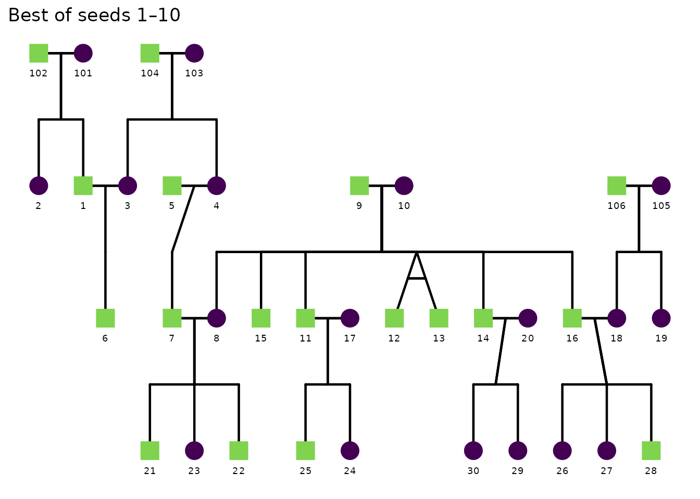

``` r


p1 <- ggPedigree(
  potter,
  famID = "famID", personID = "personID",
  momID = "momID", dadID = "dadID",
  config = list(
    founder_order_seed = 5L,
    label_include = TRUE, label_text_size = 2.5
  )
)
p2 <- ggPedigree(
  potter,
  famID = "famID", personID = "personID",
  momID = "momID", dadID = "dadID",
  config = list(
    label_include = TRUE, label_text_size = 2.5
  )
)
cowplot::plot_grid(p1 + ggplot2::ggtitle("Seed 5") + theme_linedraw(),
  NULL,
  p2 + ggplot2::ggtitle("Default") + theme_linedraw(),
  NULL,
  ncol = 2,
  byrow = T,
  rel_widths = c(1, .1, 1, .1)
)
```

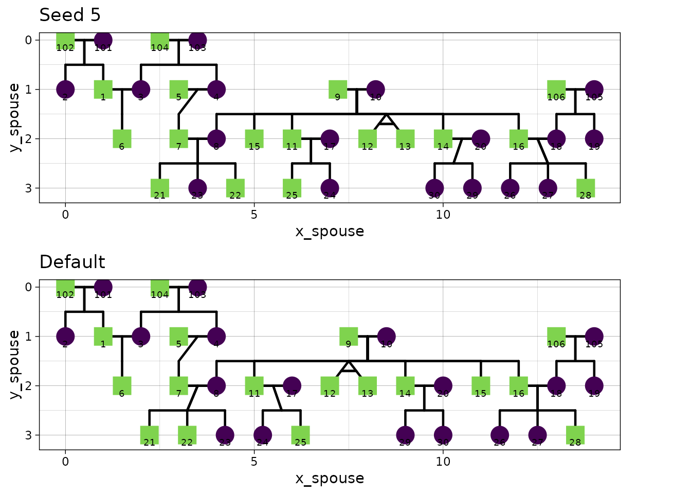

To make the result reproducible, always pair `founder_order_tries` with
an explicit `founder_order_seed`. Without a seed, the function tries
seeds `1, 2, …, N`—still deterministic, but recording the seed in your
config makes the intent explicit.

> **Tip:** For very large pedigrees the search can be slow because each
> trial reruns the full layout calculation. Start with a small
> `founder_order_tries` (5–10) to identify a good region, then fix the
> winning seed for production plots.

## Saving and loading a config file

If you want to reuse the same overrides across scripts or share them
with collaborators, save your config list.

``` r

cfg <- list(
  point_scale_by_pedigree = FALSE,
  point_size = 6,
  segment_linewidth = 0.7,
  label_include = TRUE,
  label_text_size = 3,
  sex_color_palette = c("purple", "orange", "grey50")
)

saveRDS(cfg, file = "ggpedigree_config.rds")

cfg <- readRDS("ggpedigree_config.rds")

ggPedigree(
  potter,
  famID = "famID",
  personID = "personID",
  momID = "momID",
  dadID = "dadID",
  config = cfg
)
```

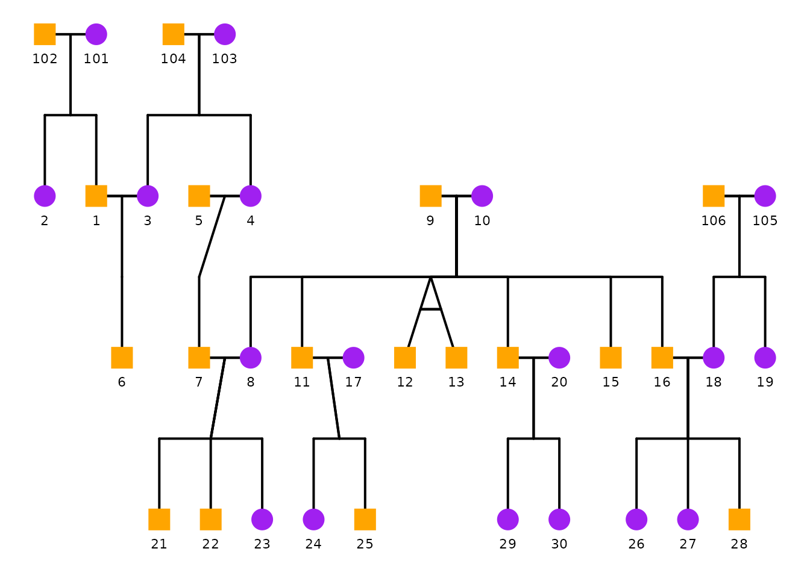

## Config reference

The `config` argument accepts many options. Most users will only change
a small subset, but the full list of supported keys can be printed
programmatically.

**Show all config keys (names only)**

``` r

cfg_names <- sort(names(ggpedigree:::getDefaultPlotConfig("ggPedigree")))

tibble::tibble(Config_Key = cfg_names) %>%
  knitr::kable()
```

| Config_Key                     |
|:-------------------------------|
| add_phantoms                   |
| affected_fill_code_affected    |
| affected_fill_code_unaffected  |
| affected_fill_color_affected   |
| affected_fill_color_unaffected |
| affected_fill_include          |
| affected_fill_label_affected   |
| affected_fill_label_unaffected |
| affected_fill_shape_female     |
| affected_fill_shape_male       |
| affected_fill_shape_unknown    |
| alpha                          |
| annotate_include               |
| annotate_x_shift               |
| annotate_y_shift               |
| apply_default_scales           |
| apply_default_theme            |
| axis_text_angle_x              |
| axis_text_angle_y              |
| axis_text_color                |
| axis_text_family               |
| axis_text_size                 |
| axis_x_label                   |
| axis_y_label                   |
| ci_include                     |
| ci_ribbon_alpha                |
| code_female                    |
| code_male                      |
| code_na                        |
| code_unknown                   |
| color_palette_default          |
| color_palette_high             |
| color_palette_low              |
| color_palette_mid              |
| color_scale_midpoint           |
| color_scale_theme              |
| color_theme                    |
| coord_layout                   |
| coord_radial_end_angle         |
| coord_radial_min_radius        |
| coord_radial_scale             |
| coord_radial_start_angle       |
| debug                          |
| drop_classic_kin               |
| drop_non_classic_sibs          |
| fast_threshold                 |
| filter_degree_max              |
| filter_degree_min              |
| filter_n_pairs                 |
| fixed_positions                |
| fixed_positions_update_family  |
| focal_fill_chroma              |
| focal_fill_component           |
| focal_fill_force_zero          |
| focal_fill_high_color          |
| focal_fill_hue_direction       |
| focal_fill_hue_range           |
| focal_fill_include             |
| focal_fill_legend_show         |
| focal_fill_legend_title        |
| focal_fill_lightness           |
| focal_fill_low_color           |
| focal_fill_method              |
| focal_fill_mid_color           |
| focal_fill_n_breaks            |
| focal_fill_na_color            |
| focal_fill_personID            |
| focal_fill_scale_midpoint      |
| focal_fill_shape               |
| focal_fill_use_log             |
| focal_fill_viridis_begin       |
| focal_fill_viridis_direction   |
| focal_fill_viridis_end         |
| focal_fill_viridis_option      |
| founder_order_seed             |
| founder_order_tries            |
| generation_height              |
| generation_width               |
| group_by_kin                   |
| grouping_column                |
| hints                          |
| label_column                   |
| label_include                  |
| label_max_overlaps             |
| label_method                   |
| label_nudge_x                  |
| label_nudge_y                  |
| label_nudge_y_flip             |
| label_scale_by_pedigree        |
| label_segment_color            |
| label_text_angle               |
| label_text_color               |
| label_text_family              |
| label_text_size                |
| layout_score_method            |
| match_threshold_percent        |
| matrix_diagonal_include        |
| matrix_fill_legend_title       |
| matrix_isChild_method          |
| matrix_lower_triangle_include  |
| matrix_sparse                  |
| matrix_upper_triangle_include  |
| max_degree_levels              |
| optimize_plotly                |
| outline_additional_size        |
| outline_alpha                  |
| outline_color                  |
| outline_color_affected         |
| outline_color_code_affected    |
| outline_color_code_unaffected  |
| outline_color_include          |
| outline_color_label_affected   |
| outline_color_label_unaffected |
| outline_color_unaffected       |
| outline_include                |
| outline_multiplier             |
| overlay_alpha_affected         |
| overlay_alpha_unaffected       |
| overlay_code_affected          |
| overlay_code_unaffected        |
| overlay_color                  |
| overlay_include                |
| overlay_label_affected         |
| overlay_label_unaffected       |
| overlay_legend_show            |
| overlay_legend_title           |
| overlay_mode                   |
| overlay_shape                  |
| overlay_size                   |
| overlay_stroke                 |
| override_many2many             |
| ped_align                      |
| ped_packed                     |
| ped_width                      |
| plot_subtitle                  |
| plot_title                     |
| point_scale_by_pedigree        |
| point_size                     |
| preset                         |
| recode_missing_ids             |
| recode_missing_sex             |
| reduce_variables               |
| relation                       |
| reposition_founders            |
| return_best_seed               |
| return_interactive             |
| return_mid_parent              |
| return_static                  |
| return_widget                  |
| segment_default_color          |
| segment_lineage_component      |
| segment_lineage_focal_personID |
| segment_lineage_force_zero     |
| segment_lineage_include        |
| segment_lineage_legend_show    |
| segment_lineage_legend_title   |
| segment_lineage_method         |
| segment_lineage_na_color       |
| segment_lineage_palette        |
| segment_lineage_types          |
| segment_lineend                |
| segment_linejoin               |
| segment_linetype               |
| segment_linewidth              |
| segment_mz_alpha               |
| segment_mz_color               |
| segment_mz_linetype            |
| segment_mz_t                   |
| segment_offspring_color        |
| segment_parent_color           |
| segment_scale_by_pedigree      |
| segment_self_alpha             |
| segment_self_angle             |
| segment_self_color             |
| segment_self_curvature         |
| segment_self_linetype          |
| segment_self_linewidth         |
| segment_sibling_color          |
| segment_spouse_alpha           |
| segment_spouse_color           |
| sex_color_include              |
| sex_color_palette              |
| sex_legend_show                |
| sex_legend_title               |
| sex_shape_female               |
| sex_shape_include              |
| sex_shape_labels               |
| sex_shape_male                 |
| sex_shape_unknown              |
| spread_out_generations         |
| spread_out_generations_factor  |
| status_alpha_affected          |
| status_alpha_unaffected        |
| status_code_affected           |
| status_code_unaffected         |
| status_color_affected          |
| status_color_palette           |
| status_color_unaffected        |
| status_include                 |
| status_label_affected          |
| status_label_unaffected        |
| status_legend_show             |
| status_legend_title            |
| status_shape_affected          |
| tile_cluster                   |
| tile_color_border              |
| tile_color_palette             |
| tile_geom                      |
| tile_interpolate               |
| tile_linejoin                  |
| tile_na_rm                     |
| tooltip_columns                |
| tooltip_include                |
| use_only_classic_kin           |
| use_relative_degree            |
| value_rounding_digits          |

**Show all config keys with defaults**

``` r

df <- ggpedigree:::getDefaultPlotConfig("ggPedigree") %>%
  # is a list
  unlist() %>%
  as.data.frame() %>%
  tibble::rownames_to_column(var = "Config_Key") %>%
  rename(Default_Value = ".")
df %>%
  knitr::kable()
```

| Config_Key                     | Default_Value  |
|:-------------------------------|:---------------|
| apply_default_scales           | TRUE           |
| segment_default_color          | black          |
| apply_default_theme            | TRUE           |
| color_theme                    | color          |
| color_palette_default1         | \#440154FF     |
| color_palette_default2         | \#7fd34e       |
| color_palette_default3         | \#f1e51d       |
| color_palette_low              | \#000004FF     |
| color_palette_mid              | \#56106EFF     |
| color_palette_high             | \#FCFDBFFF     |
| color_scale_midpoint           | 0.5            |
| color_scale_theme              | ggthemes::calc |
| alpha                          | 1              |
| value_rounding_digits          | 3              |
| code_male                      | 1              |
| code_na                        | NA             |
| code_female                    | 0              |
| code_unknown                   | NA             |
| filter_n_pairs                 | 500            |
| filter_degree_min              | 0              |
| filter_degree_max              | 7              |
| drop_classic_kin               | FALSE          |
| drop_non_classic_sibs          | TRUE           |
| use_only_classic_kin           | TRUE           |
| use_relative_degree            | TRUE           |
| group_by_kin                   | TRUE           |
| match_threshold_percent        | 10             |
| max_degree_levels              | 12             |
| grouping_column                | mtdna_factor   |
| annotate_include               | TRUE           |
| annotate_x_shift               | -0.1           |
| annotate_y_shift               | 0.005          |
| label_include                  | TRUE           |
| label_column                   | personID       |
| label_method                   | geom_text      |
| label_max_overlaps             | 25             |
| label_nudge_x                  | 0              |
| label_nudge_y                  | 0.15           |
| label_nudge_y_flip             | TRUE           |
| label_segment_color            | NA             |
| label_text_angle               | 0              |
| label_text_size                | 3              |
| label_text_color               | black          |
| label_text_family              | sans           |
| label_scale_by_pedigree        | TRUE           |
| point_size                     | 6              |
| point_scale_by_pedigree        | TRUE           |
| outline_include                | FALSE          |
| outline_multiplier             | 1.25           |
| outline_color                  | black          |
| outline_additional_size        | 0              |
| outline_alpha                  | 1              |
| tooltip_include                | TRUE           |
| tooltip_columns1               | ID1            |
| tooltip_columns2               | ID2            |
| tooltip_columns3               | value          |
| axis_text_angle_x              | 90             |
| axis_text_angle_y              | 0              |
| axis_text_size                 | 9              |
| axis_text_color                | black          |
| axis_text_family               | sans           |
| generation_height              | 1              |
| generation_width               | 1              |
| segment_linewidth              | 0.8            |
| segment_linetype               | 1              |
| segment_lineend                | round          |
| segment_linejoin               | round          |
| segment_scale_by_pedigree      | FALSE          |
| segment_offspring_color        | black          |
| segment_parent_color           | black          |
| segment_self_color             | black          |
| segment_sibling_color          | black          |
| segment_spouse_color           | black          |
| segment_spouse_alpha           | 1              |
| segment_mz_color               | black          |
| segment_mz_linetype            | 1              |
| segment_mz_alpha               | 1              |
| segment_mz_t                   | 0.6            |
| segment_self_linetype          | dotdash        |
| segment_self_alpha             | 0.5            |
| segment_self_angle             | 90             |
| segment_self_curvature         | -0.2           |
| segment_self_linewidth         | 0.4            |
| segment_lineage_include        | FALSE          |
| segment_lineage_component      | mitochondrial  |
| segment_lineage_types1         | parent         |
| segment_lineage_types2         | offspring      |
| segment_lineage_types3         | sibling        |
| segment_lineage_types4         | mz             |
| segment_lineage_types5         | spouse         |
| segment_lineage_method         | viridis_d      |
| segment_lineage_palette1       | \#052f60       |
| segment_lineage_palette2       | \#e69f00       |
| segment_lineage_palette3       | \#56b4e9       |
| segment_lineage_palette4       | \#009e73       |
| segment_lineage_palette5       | \#f0e442       |
| segment_lineage_palette6       | \#0072b2       |
| segment_lineage_palette7       | \#d55e00       |
| segment_lineage_palette8       | \#cc79a7       |
| segment_lineage_na_color       | grey80         |
| segment_lineage_force_zero     | TRUE           |
| segment_lineage_legend_show    | FALSE          |
| segment_lineage_legend_title   | Lineage        |
| sex_color_include              | TRUE           |
| sex_legend_title               | Sex            |
| sex_shape_labels1              | Female         |
| sex_shape_labels2              | Male           |
| sex_shape_labels3              | Unknown        |
| sex_color_palette1             | \#440154FF     |
| sex_color_palette2             | \#7fd34e       |
| sex_color_palette3             | \#f1e51d       |
| sex_shape_female               | 16             |
| sex_shape_male                 | 15             |
| sex_shape_unknown              | 18             |
| sex_legend_show                | FALSE          |
| sex_shape_include              | TRUE           |
| status_include                 | TRUE           |
| status_code_affected           | 1              |
| status_code_unaffected         | 0              |
| status_label_affected          | Affected       |
| status_label_unaffected        | Unaffected     |
| status_alpha_affected          | 1              |
| status_alpha_unaffected        | 0              |
| status_color_palette1          | \#440154FF     |
| status_color_palette2          | \#7fd34e       |
| status_color_affected          | black          |
| status_color_unaffected        | \#7fd34e       |
| status_shape_affected          | 4              |
| status_legend_title            | Affected       |
| status_legend_show             | FALSE          |
| overlay_shape                  | 4              |
| overlay_code_affected          | 1              |
| overlay_code_unaffected        | 0              |
| overlay_label_affected         | Affected       |
| overlay_label_unaffected       | Unaffected     |
| overlay_alpha_unaffected       | 0              |
| overlay_color                  | black          |
| overlay_alpha_affected         | 1              |
| overlay_include                | FALSE          |
| overlay_mode                   | alpha          |
| overlay_stroke                 | 1.5            |
| overlay_legend_title           | Overlay        |
| overlay_legend_show            | FALSE          |
| focal_fill_include             | FALSE          |
| focal_fill_legend_show         | TRUE           |
| focal_fill_personID            | 1              |
| focal_fill_legend_title        | Focal Fill     |
| focal_fill_high_color          | \#FDE725FF     |
| focal_fill_mid_color           | \#9F2A63FF     |
| focal_fill_low_color           | \#0D082AFF     |
| focal_fill_scale_midpoint      | 0.5            |
| focal_fill_method              | gradient       |
| focal_fill_component           | additive       |
| focal_fill_shape               | 21             |
| focal_fill_na_color            | black          |
| focal_fill_use_log             | FALSE          |
| focal_fill_force_zero          | FALSE          |
| focal_fill_hue_range1          | 0              |
| focal_fill_hue_range2          | 360            |
| focal_fill_chroma              | 50             |
| focal_fill_lightness           | 50             |
| focal_fill_hue_direction       | horizontal     |
| focal_fill_viridis_option      | D              |
| focal_fill_viridis_begin       | 0              |
| focal_fill_viridis_end         | 1              |
| focal_fill_viridis_direction   | 1              |
| ci_include                     | TRUE           |
| ci_ribbon_alpha                | 0.3            |
| tile_color_palette1            | white          |
| tile_color_palette2            | gold           |
| tile_color_palette3            | red            |
| tile_color_border              | NA             |
| tile_cluster                   | TRUE           |
| tile_interpolate               | TRUE           |
| tile_geom                      | geom_tile      |
| tile_na_rm                     | FALSE          |
| tile_linejoin                  | mitre          |
| matrix_fill_legend_title       | Relatedness    |
| matrix_sparse                  | FALSE          |
| matrix_isChild_method          | partialparent  |
| matrix_diagonal_include        | TRUE           |
| matrix_upper_triangle_include  | FALSE          |
| matrix_lower_triangle_include  | TRUE           |
| return_static                  | FALSE          |
| return_widget                  | FALSE          |
| return_interactive             | FALSE          |
| return_mid_parent              | FALSE          |
| reduce_variables               | TRUE           |
| reposition_founders            | TRUE           |
| ped_packed                     | TRUE           |
| ped_align                      | TRUE           |
| ped_width                      | 15             |
| fast_threshold                 | 1000           |
| founder_order_tries            | 1              |
| layout_score_method            | composite      |
| return_best_seed               | FALSE          |
| fixed_positions_update_family  | TRUE           |
| coord_layout                   | cartesian      |
| coord_radial_start_angle       | -90            |
| coord_radial_end_angle         | 270            |
| coord_radial_scale             | 1.5            |
| coord_radial_min_radius        | 0.75           |
| spread_out_generations         | TRUE           |
| spread_out_generations_factor  | 0.5            |
| override_many2many             | FALSE          |
| optimize_plotly                | TRUE           |
| recode_missing_ids             | TRUE           |
| recode_missing_sex             | TRUE           |
| add_phantoms                   | FALSE          |
| debug                          | FALSE          |
| affected_fill_include          | FALSE          |
| affected_fill_code_affected    | 1              |
| affected_fill_code_unaffected  | 0              |
| affected_fill_label_affected   | Affected       |
| affected_fill_label_unaffected | Unaffected     |
| affected_fill_color_affected   | black          |
| affected_fill_color_unaffected | NA             |
| affected_fill_shape_female     | 21             |
| affected_fill_shape_male       | 22             |
| affected_fill_shape_unknown    | 23             |
| outline_color_include          | FALSE          |
| outline_color_code_affected    | 1              |
| outline_color_code_unaffected  | 0              |
| outline_color_label_affected   | Highlighted    |
| outline_color_label_unaffected | Default        |
| outline_color_affected         | blue           |
| outline_color_unaffected       | black          |
| preset                         | none           |
