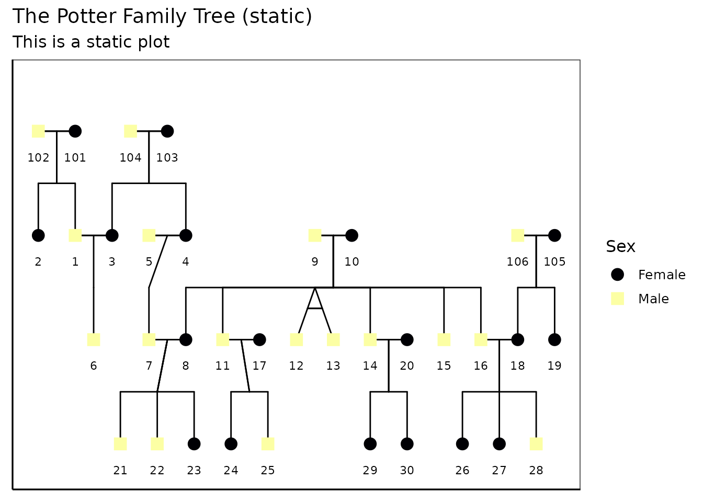

# Extended: More Complex Pedigree Plots with ggPedigreeInteractive

``` r
library(ggpedigree) # ggPedigree lives here
library(BGmisc) # helper utilities & example data
library(ggplot2) # ggplot2 for plotting
library(viridis) # viridis for color palettes
library(tidyverse) # for data wrangling
```

This vignette demonstrates how to create interactive pedigree plots
using the
[`ggPedigreeInteractive()`](https://r-computing-lab.github.io/ggpedigree/reference/ggPedigreeInteractive.md)
function from the `ggpedigree` package. It extends the basic examples
found in the main package documentation.

## Customising labels and tool‑tips

[`ggPedigreeInteractive()`](https://r-computing-lab.github.io/ggpedigree/reference/ggPedigreeInteractive.md)
accepts the same config list as
[`ggPedigree()`](https://r-computing-lab.github.io/ggpedigree/reference/ggPedigree.md),
plus the tooltip_columns argument for hover text. Below we enable node
labels, nudge them upward a little, color by sex, and show both the
`personID` and name fields in the hover:

``` r
plt <- ggPedigreeInteractive(
  potter,
  famID = "famID",
  personID = "personID",
  momID = "momID",
  dadID = "dadID",
  config = list(
    label_nudge_y = .25,
    label_include = TRUE,
    label_method = "geom_text",
    sex_color_include = TRUE
  ),
  tooltip_columns = c("personID", "name")
)
```

``` r
plt
```

## Further customisation

### Adding tooltips

Because the function returns a Plotly object, you can layer additional
modifications on top:

``` r
plt2 <- plt %>%
  plotly::layout(
    title = "The Potter Family Tree (interactive)",
    hoverlabel = list(bgcolor = "white"),
    margin = list(l = 50, r = 50, t = 50, b = 50)
  ) %>%
  plotly::config(displayModeBar = TRUE)
```

``` r
plt2
```

You can also save the widget as standalone HTML:

``` r
htmlwidgets::saveWidget(
  plt,
  file = "potter_interactive.html",
  selfcontained = TRUE
)
# Note: The above code will save the widget in the current working directory.
```

### Static Plot customisation

You can also create a static version of the plot using the
`return_static` argument. This is useful for generating high-quality
images for reports or publications. The static plot can be further
customized using ggplot2 functions. It can also be plotted using
[`plotly::ggplotly()`](https://rdrr.io/pkg/plotly/man/ggplotly.html) to
retain interactivity.

``` r
static <- ggPedigreeInteractive(
  potter,
  famID = "famID",
  personID = "personID",
  momID = "momID",
  dadID = "dadID",
  config = list(
    label_nudge_y = .25,
    label_include = TRUE,
    label_method = "geom_text",
    sex_color_include = TRUE,
    return_static = TRUE
  ),
  tooltip_columns = c("personID", "name")
)
```

The static plot can be further customized using ggplot2 functions.

``` r
static_plot <- static +
  ggplot2::labs(
    title = "The Potter Family Tree (static)",
    subtitle = "This is a static plot"
  ) +
  theme_bw(base_size = 12) +
  theme(
    panel.grid.major = element_blank(),
    panel.grid.minor = element_blank(),
    panel.background = element_blank(),
    axis.line        = element_line(colour = "black"),
    axis.text.x      = element_blank(),
    axis.text.y      = element_blank(),
    axis.ticks.x     = element_blank(),
    axis.ticks.y     = element_blank(),
    axis.title.x     = element_blank(),
    axis.title.y     = element_blank()
  ) + scale_color_viridis(
    option = "inferno",
    discrete = TRUE,
    labels = c("Female", "Male", "Unknown")
  )
#> Scale for colour is already present.
#> Adding another scale for colour, which will replace the existing scale.

static_plot
```



You can also convert the static plot back to an interactive plot using
[`plotly::ggplotly()`](https://rdrr.io/pkg/plotly/man/ggplotly.html):

``` r
plt2 <- plotly::ggplotly(static_plot,
  tooltip = "text",
  width   = NULL,
  height  = NULL
)
```

``` r
plt2
```

## Customizing the interactive plot

You can customize the interactive plot further by modifying the layout,
adding titles, and adjusting hover labels. The `plotly::layout()`
function allows you to set various layout options such as title,
margins, and hover label styles.

``` r
library(BGmisc)
data(hazard)

df <- hazard

ggPedigreeInteractive(
  df,
  famID = "famID",
  personID = "ID",
  momID = "momID",
  dadID = "dadID",
  config = list(
    code_male = 0,
    status_column = "affected",
    label_nudge_y = .25,
    label_include = TRUE,
    include_tooltip = TRUE,
    label_method = "geom_text",
    sex_color_include = TRUE
  ),
  tooltip_columns = c("personID", "birthYr", "onsetYr", "deathYr")
) %>%
  plotly::layout(
    title = "Hazard Pedigree (interactive)",
    hoverlabel = list(bgcolor = "white"),
    margin = list(l = 50, r = 50, t = 50, b = 50)
  ) %>%
  plotly::config(displayModeBar = TRUE)
#> Warning in buildPlotConfig(default_config = default_config, config = config, :
#> The following config values are not recognized by getDefaultPlotConfig():
#> include_tooltip
```

## Conclusion

[`ggPedigreeInteractive()`](https://r-computing-lab.github.io/ggpedigree/reference/ggPedigreeInteractive.md)
provides a powerful way to visualize pedigree data interactively. By
leveraging the capabilities of Plotly, users can explore their data in a
more dynamic and engaging manner. The function is designed to be
flexible, allowing for customization of labels, tooltips, and overall
aesthetics.
