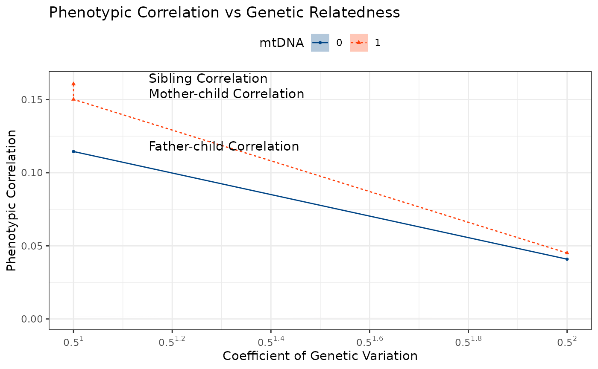

# Extended: Plotting Phenotypic Correlation by Degree of Relatedness

This vignette demonstrates how to visualize phenotypic correlation by
degree of relatedness using the `ggPhenotypeByDegree` function from the
`ggpedigree` package. This function is particularly useful for analyzing
and visualizing the relationship between phenotypic traits and genetic
relatedness in pedigree data. It extends the basic examples found in the
main package documentation.

The example below uses a squirrel pedigree dataset to illustrate how to
create a plot showing the phenotypic correlation across different
degrees of relatedness.

Click to expand pedigree setup

``` r
library(ggpedigree)
library(BGmisc)
library(data.table)
# Load the example data
data("redsquirrels")
library(dplyr)
# library(broom) # for tidy()
library(purrr) # for map_* helpers
# Filter for the largest family, recode sex if needed
ped_filtered <- redsquirrels_full %>%
  recodeSex(code_female = "F") %>%
  filter(famID == 160)

kin_degree_max <- 12 # maximum degree of relatedness to consider
# Calculate relatedness matrices
add_mat <- ped2add(ped_filtered, isChild_method = "partialparent", sparse = TRUE)
mit_mat <- ped2mit(ped_filtered, isChild_method = "partialparent", sparse = TRUE)
cn_mat <- ped2cn(ped_filtered, isChild_method = "partialparent", sparse = TRUE)

df_links <- com2links(
  writetodisk = FALSE,
  ad_ped_matrix = add_mat,
  mit_ped_matrix = mit_mat,
  cn_ped_matrix = cn_mat,
  drop_upper_triangular = TRUE,
  gc = FALSE
)
```

``` r
dataRelatedPair_merge <- df_links %>%
  left_join(ped_filtered %>% select(personID, lrs, ars_n),
    by = c("ID1" = "personID")
  ) %>%
  rename(
    lrs_k1 = lrs,
    ars_n_k1 = ars_n
  ) %>%
  left_join(ped_filtered %>% select(personID, lrs, ars_n),
    by = c("ID2" = "personID")
  ) %>%
  rename(
    lrs_k2 = lrs,
    ars_n_k2 = ars_n
  )

# double enter
dxlist <- c(
  "ID1", "ID2", # intentional ordering
  "addRel", "mitRel",
  "cnuRel",
  names(dataRelatedPair_merge)[endsWith(names(dataRelatedPair_merge), "_k2")],
  names(dataRelatedPair_merge)[endsWith(names(dataRelatedPair_merge), "_k1")]
)

kin_degrees <- 0:12
rel_vals <- 2^(-kin_degrees)
rel_bins <- purrr::map_chr(rel_vals, ~ paste0("addRel_", .x))
rel_labels <- c("addRel_1+" = "addRel_1+")

# bin assignment function
assign_addRel_bin <- function(rel) {
  for (val in rel_vals) {
    upper <- val * 1.1
    lower <- val * 0.9
    if (!is.na(rel) && rel >= lower && rel <= upper) {
      return(paste0("addRel_", val))
    } else if (!is.na(rel) && rel > upper) {
      return(paste0("addRel_+", val))
    }
  }
  if (!is.na(rel) && rel > 2^0 * 1.1) {
    return("addRel_1+")
  }
  if (!is.na(rel) && rel == 0) {
    return("addRel_0")
  }
  return(NA_character_)
}


dataRelatedPair_merge <- data.table::rbindlist(
  list(
    dataRelatedPair_merge,
    dataRelatedPair_merge[, dxlist]
  ),
  use.names = FALSE
) %>%
  mutate(addRel_bin = vapply(addRel, assign_addRel_bin, character(1))) %>%
  mutate(addRel_factor = factor(addRel_bin, levels = c("addRel_1+", rel_bins, paste0("addRel_+", rel_vals), "addRel_+0", "addRel_0"))) %>%
  select(-addRel_bin)


result <- dataRelatedPair_merge %>%
  group_by(addRel_factor, mitRel, cnuRel) %>%
  summarise(
    n_pairs = n() / 2, # divide by 2 to account for double counting
    lrs_cor_test = list(tryCatch(cor.test(lrs_k1, lrs_k2, use = "pairwise.complete.obs"),
      error = function(e) NULL
    )),
    ars_n_cor_test = list(tryCatch(cor.test(ars_n_k1, ars_n_k2, use = "pairwise.complete.obs"),
      error = function(e) NULL
    )),
    addRel_mean = mean(addRel, na.rm = TRUE),
    addRel_sd = sd(addRel, na.rm = TRUE),
    addRel_min = min(addRel, na.rm = TRUE),
    addRel_max = max(addRel, na.rm = TRUE),
    .groups = "drop" # eliminates the need for ungroup()
  ) %>%
  ## unpack the two cor.test() objects -------------------------------
  mutate(
    # ---- LRS pair ----
    cor_lrs = map_dbl(lrs_cor_test, ~ if (is.null(.x)) NA_real_ else .x$estimate),
    cor_lrs_stat = map_dbl(lrs_cor_test, ~ if (is.null(.x)) NA_real_ else .x$statistic),
    cor_lrs_p = map_dbl(lrs_cor_test, ~ if (is.null(.x)) NA_real_ else .x$p.value),
    cor_lrs_df = map_dbl(lrs_cor_test, ~ if (is.null(.x)) NA_real_ else .x$parameter),
    cor_lrs_ci_lb = map_dbl(lrs_cor_test, ~ if (is.null(.x)) NA_real_ else .x$conf.int[1] * sqrt(2)),
    cor_lrs_ci_ub = map_dbl(lrs_cor_test, ~ if (is.null(.x)) NA_real_ else .x$conf.int[2] * sqrt(2)),

    # ---- ARS‑n pair ----
    cor_ars_n = map_dbl(ars_n_cor_test, ~ if (is.null(.x)) NA_real_ else .x$estimate),
    cor_ars_n_stat = map_dbl(ars_n_cor_test, ~ if (is.null(.x)) NA_real_ else .x$statistic),
    cor_ars_n_p = map_dbl(ars_n_cor_test, ~ if (is.null(.x)) NA_real_ else .x$p.value),
    cor_ars_n_df = map_dbl(ars_n_cor_test, ~ if (is.null(.x)) NA_real_ else .x$parameter),
    cor_ars_n_ci_lb = map_dbl(ars_n_cor_test, ~ if (is.null(.x)) NA_real_ else .x$conf.int[1] * sqrt(2)),
    cor_ars_n_ci_ub = map_dbl(ars_n_cor_test, ~ if (is.null(.x)) NA_real_ else .x$conf.int[2] * sqrt(2))
  ) %>%
  select(-lrs_cor_test, -ars_n_cor_test) %>% # drop the list‑columns once unpacked
  rename(cnu = cnuRel, mtdna = mitRel)
```

The resulting data frame `result` contains the phenotypic correlations
for lifetime reproductive success (LRS) and annual reproductive success
(ARS-n) across different degrees of relatedness, along with confidence
intervals and p-values.

``` r
head(result)
#> # A tibble: 6 × 20
#>   addRel_factor mtdna   cnu n_pairs addRel_mean addRel_sd addRel_min addRel_max
#>   <fct>         <dbl> <dbl>   <dbl>       <dbl>     <dbl>      <dbl>      <dbl>
#> 1 addRel_1          1     1     103       1      1.90e-17      1          1    
#> 2 addRel_0.5        0     0       1       0.5    0             0.5        0.5  
#> 3 addRel_0.5        1     0     101       0.5    2.35e-17      0.5        0.5  
#> 4 addRel_0.25       0     0       1       0.25   0             0.25       0.25 
#> 5 addRel_0.25       1     0     544       0.25   1.43e-17      0.25       0.25 
#> 6 addRel_0.125      0     0       8       0.125  0             0.125      0.125
#> # ℹ 12 more variables: cor_lrs <dbl>, cor_lrs_stat <dbl>, cor_lrs_p <dbl>,
#> #   cor_lrs_df <dbl>, cor_lrs_ci_lb <dbl>, cor_lrs_ci_ub <dbl>,
#> #   cor_ars_n <dbl>, cor_ars_n_stat <dbl>, cor_ars_n_p <dbl>,
#> #   cor_ars_n_df <dbl>, cor_ars_n_ci_lb <dbl>, cor_ars_n_ci_ub <dbl>
```

## Phenotypic Correlation by Degree of Relatedness

``` r
ggPhenotypeByDegree(
  df = result,
  y_var = "cor_lrs",
  y_ci_lb = "cor_lrs_ci_lb",
  y_ci_ub = "cor_lrs_ci_ub",
  config = list(
    use_only_classic_kin = FALSE,
    drop_classic_kin = FALSE,
    group_by_kin = TRUE,
    use_relative_degree = TRUE,
    drop_non_classic_sibs = FALSE,
    filter_degree_max = 12,
    grouping_column = "mtdna_factor",
    filter_n_pairs = 10
  )
)
```


## Pedigree Setup

Click to expand pedigree setup

``` r
library(tibble)
library(dplyr)
library(ggpedigree)
df <- pedigree_df <- tribble(
  ~n_pairs,
  ~addRel_min,
  ~addRel_max,
  ~addRel_emp_min,
  ~addRel_emp_mean,
  ~addRel_emp_median,
  ~addRel_emp_max,
  ~mtdna,
  ~cnu,
  ~age_k1_meanFunction,
  ~male_k1_meanFunction,
  ~same_matID_meanFunction,
  ~same_patID_meanFunction,
  ~USA_flag_10_k1_meanFunction,
  ~USA_flag_10_polychorFunction_rho,
  ~USA_flag_10_polychorFunction_se,
  ~USA_flag_10_polychorFunction_chisq,
  ~USA_flag_10_polychorFunction_df,
  ~USA_flag_10_ml_polychorFunction,
  3617250, 0.225, 0.275, 0.2255859375, 0.247734086859983, 0.25, 0.27490234375, 1, 0, 59.2335021779651, 0.480619365892598, NA, NA, 0.249700992238048, 0.04517140756813, 0.000691314990032303, 0.00000799819827079773, 0, 0.0451713825840523,
  4983424, 0.225, 0.275, 0.2255859375, 0.247985118108249, 0.25, 0.27490234375, 0, 0, 60.2924621468198, 0.54683237363258, NA, NA, 0.247046760504304, 0.0409988164718674, 0.000599673001112523, 0.00000799819827079773, 0, 0.040998793040341,
  120024, 0.275, 0.45, 0.359375, 0.42720031928978, 0.4375, 0.44921875, 1, 1, 55.3786442198885, 0.519857671410953, NA, NA, 0.208202301154754, 0.169242204331722, 0.00393269696620211, 0.00000814738450571895, 0, 0.169234306738862,
  137947, 0.275, 0.45, 0.275146484375, 0.336850848231778, 0.34375, 0.447265625, 1, 0, 58.7404851093794, 0.436444779593302, NA, NA, 0.230130064360623, 0.0979941906533943, 0.00359788288853913, 0.00000800052657723427, 0, 0.0979945954952227,
  108989, 0.275, 0.45, 0.275390625, 0.328092281014401, 0.3125, 0.4453125, 0, 0, 60.2531852003308, 0.619355993501189, NA, NA, 0.233078768161892, 0.0774003012451702, 0.00404657995476565, 0.00000800139969214797, 0, 0.0774005589379321,
  1668205, 0.45, 0.55, 0.4501953125, 0.495319721631096, 0.4990234375, 0.549560546875, 1, 1, 57.9295757847709, 0.522333747318167, NA, NA, 0.257514897453126, 0.160645710133276, 0.000975187176863543, 0.0000904696062207222, 0, 0.16065612400207,
  729441, 0.45, 0.55, 0.451171875, 0.496536543871464, 0.5, 0.5498046875, 1, 0, 66.1279781018233, 0.275059425002599, NA, NA, 0.265100488202374, 0.150191012774079, 0.00152996759330951, 0.00000815372914075851, 0, 0.150193105587773,
  747643, 0.45, 0.55, 0.451171875, 0.49663045074013, 0.5, 0.5478515625, 0, 0, 65.9430606759445, 0.749751203807075, NA, NA, 0.262018010446397, 0.114532502819044, 0.00154238295730097, 0.00000800378620624542, 0, 0.114533380385551,
  44787, 0.55, 0.9, 0.55029296875, 0.724711065168643, 0.75, 0.8984375, 1, 1, 63.4350717031309, 0.520855662736692, NA, NA, 0.232835687466476, 0.9999, Inf, 29160.6932985728, 0, 0.952963916809192,
  4639, 0.55, 0.9, 0.55029296875, 0.569994330072125, 0.5625, 0.75, 1, 0, 62.3524143288736, 0.366174409830764, NA, NA, 0.231225722917566, 0.12373864513677, 0.0194548428304584, 0.00000800392444944009, 0, 0.123740641721645,
  2744, 0.55, 0.9, 0.55078125, 0.566952741528391, 0.5625, 0.75, 0, 0, 62.2241888686131, 0.758432087511395, NA, NA, 0.228467153284672, 0.123400997830296, 0.0254117516477019, 0.00000801651367510203, 0, 0.123405021390264,
  1018929, 0.9, 1.1, 0.90234375, 0.994306976854356, 1, 1.09375, 1, 1, 61.9059012997516, 0.523600756854653, NA, NA, 0.254706541475618, 0.9999, Inf, 12530.2189094715, 0, 0.9999,
  352, 1.1, 1.5, 1.1005859375, 1.12844427065416, 1.125, 1.25, 1, 1, 47.7579829059829, 0.545454545454545, NA, NA, 0.153846153846154, 0.9999, Inf, 3.76616019073219, 0, 0.9999
)
```

``` r
ggPhenotypeByDegree(
  df = df,
  y_var = "USA_flag_10_polychorFunction_rho",
  y_stem_se = "USA_flag_10_polychorFunction",
  y_se = "USA_flag_10_polychorFunction_se"
)
```


