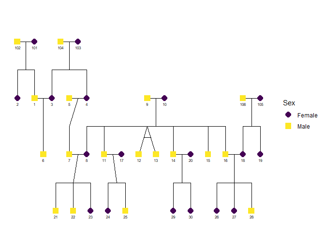

# ggpedigree

`ggpedigree` provides modern tools for visualizing pedigree structures
using both ‘ggplot2’ and ‘plotly’. It is designed to work seamlessly
with the `BGmisc` package for simulated or empirical pedigree data, and
extends the plotting capabilities of the base-graphics functions in
`kinship2`.

The package supports:

- Static, publication-ready pedigree plots using the `ggplot2` framework

- Interactive pedigree visualizations using `plotly`

- Layout customization, complex mating structures, and duplicated
  individuals

`ggpedigree` is useful in behavior genetics, kinship analysis, and any
research involving complex pedigree data.

## Installation

You can install the released version of ggpedigree from
[CRAN](https://cran.r-project.org/) with:

``` r
install.packages("ggpedigree")
```

To install the development version of `ggpedigree` from
[GitHub](https://github.com/) use:

``` r
# install.packages("devtools")
devtools::install_github("R-Computing-Lab/ggpedigree")
```

## Demonstration

Here is a basic example of how to use `ggpedigree` to visualize a
pedigree structure. The `potter` dataset contains simulated pedigree
data for the Weasley family from the Harry Potter series.

``` r
ggPedigree(potter,
  famID = "famID",
  personID = "personID"
)
```



## Citation

If you use ggpedigree in your research or wish to refer to it, please
cite the following:

``` R
citation(package = "ggpedigree")
```

Garrison S (2025). *ggpedigree: Visualizing Pedigrees with ‘ggplot2’ and
‘plotly’*. R package version 1.0.0,
<https://github.com/R-Computing-Lab/ggpedigree/>.

A BibTeX entry for LaTeX users is

``` R
@Manual{,
  title = {ggpedigree: Visualizing Pedigrees with 'ggplot2' and 'plotly'},
  author = {S. Mason Garrison},
  year = {2025},
  note = {R package version 1.0.0},
  url = {https://github.com/R-Computing-Lab/ggpedigree/},
}
```

## Contributing

Contributions to the ggpedigree project are welcome. For guidelines on
how to contribute, please refer to the [Contributing
Guidelines](https://github.com/R-Computing-Lab/ggpedigree/blob/main/CONTRIBUTING.md).
Issues and pull requests should be submitted on the GitHub repository.
For support, please use the GitHub issues page.

### Branching and Versioning System

The development of ggpedigree follows a [GitFlow branching
strategy](https://docs.gitlab.com/user/project/repository/branches/strategies/):

- **Feature Branches**: All major changes and new features should be
  developed on separate branches created from the dev branch. Name these
  branches according to the feature or change they are meant to address.
- **Development Branch**: The `dev` branch is the main development
  branch where all feature branches are merged. This branch contains the
  latest changes and is used for testing and development purposes.
- **Main Branch** (`main`): The main branch mirrors the stable state of
  the project as seen on CRAN. Only fully tested and approved changes
  from the dev branch are merged into main to prepare for a new release.

## License

ggpedigree is licensed under the GNU General Public License v3.0. For
more details, see the
[LICENSE.md](https://github.com/R-Computing-Lab/ggpedigree/blob/main/LICENSE.md)
file.
