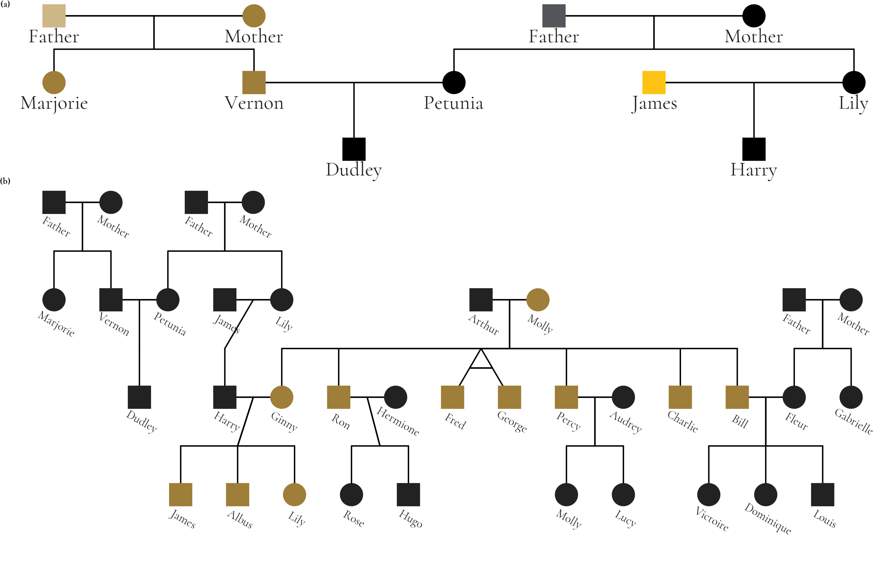

```{r setup, include=FALSE}
knitr::opts_chunk$set(
  collapse = TRUE,
  comment = "#>",
  fig.width = 7,
  fig.height = 5
)
```
```{r libraries, message=FALSE, warning=FALSE}
library(ggpedigree) # ggPedigree lives here
library(BGmisc) # helper utilities & example data
library(ggplot2) # ggplot2 for plotting
library(viridis) # viridis for color palettes
library(tidyverse) # for data wrangling
```


# Constructing Custom Pedigrees for Publication

Here we demonstrate how to create a custom pedigree using the `ggpedigree package`. The data shown here were generated using the `simulatePedigree()` function from the {BGmisc} package, which is the parent package to {ggpedigree}. These simulated pedigrees were used in a study evaluating statistical power and estimation bias for a variance decomposition model that includes mitochondrial DNA (mtDNA) effects.

The simulation generated thousands of extended pedigree structures varying in depth, sibship size, mating structure, and maternal lineage overlap. The example below shows one of the simulated pedigrees and is the version included in the final manuscript:

> Detecting mtDNA effects with an Extended Pedigree Model: An Analysis of Statistical Power and Estimation Bias
> Xuanyu Lyu, S. Alexandra Burt, Michael D. Hunter, Rachel Good, Sarah L. Carroll, S. Mason Garrison
> Preprint available at: https://doi.org/10.1101/2024.12.19.629449

The structure includes multiple generations, sibling sets, and overlapping parental lineages, and was chosen to illustrate the complexity of the simulated pedigrees used in the power study.

## Preparing the data

Each row represents one individual. Variables include `personID`, `momID`, `dadID`, `sex`, and `famID`. The proband variable is included to demonstrate status overlays. For plotting, we normalize identifiers in family 1 to avoid ID collisions across families. 

<details>
<summary>Click to expand pedigree setup</summary>

```{r, message=FALSE, warning=FALSE}
library(tibble)
library(dplyr)
pedigree_df <- tribble(
  ~personID, ~momID, ~dadID, ~sex, ~famID,
  10011, NA, NA, 0, 1,
  10012, NA, NA, 1, 1,
  10021, NA, NA, 1, 1,
  10022, 10011, 10012, 1, 1,
  10023, 10011, 10012, 0, 1,
  10024, NA, NA, 0, 1,
  10025, NA, NA, 0, 1,
  10026, 10011, 10012, 0, 1,
  10027, 10011, 10012, 1, 1,
  10031, 10023, 10021, 0, 1,
  10032, 10023, 10021, 1, 1,
  10033, 10023, 10021, 1, 1,
  10034, 10023, 10021, 1, 1,
  10035, 10023, 10021, 0, 1,
  10036, 10024, 10022, 1, 1,
  10037, 10024, 10022, 0, 1,
  10038, 10025, 10027, 1, 1,
  10039, 10025, 10027, 0, 1,
  10310, 10025, 10027, 1, 1,
  10311, 10025, 10027, 1, 1,
  10312, 10025, 10027, 0, 1,
  10011, NA, NA, 0, 2,
  10012, NA, NA, 1, 2,
  10021, NA, NA, 0, 2,
  10022, 10011, 10012, 0, 2,
  10023, 10011, 10012, 1, 2,
  10024, 10011, 10012, 1, 2,
  10025, NA, NA, 1, 2,
  10026, 10011, 10012, 0, 2,
  10027, NA, NA, 1, 2,
  10031, 10021, 10023, 1, 2,
  10032, 10021, 10023, 0, 2,
  10033, 10021, 10023, 1, 2,
  10034, 10022, 10025, 0, 2,
  10035, 10022, 10025, 0, 2,
  10036, 10022, 10025, 1, 2,
  10310, 10022, 10025, 1, 2,
  10037, 10026, 10027, 0, 2,
  10038, 10026, 10027, 0, 2,
  10039, 10026, 10027, 0, 2,
  10311, 10026, 10027, 1, 2,
  10312, 10026, 10027, 1, 2
) %>%
  mutate(
    cleanpersonID = personID - 10000,
    personID = ifelse(famID == 1, personID - 10000, personID),
    momID = ifelse(famID == 1 & !is.na(momID), momID - 10000, momID),
    dadID = ifelse(famID == 1 & !is.na(dadID), dadID - 10000, dadID),
    proband = case_when(
      personID %in% c(11, 22, 23, 26, 27, 31, 32, 33, 34, 35) ~ TRUE,
      personID %in% c(
        10011, 10022, 10022, 10023, 10024, 10026,
        10034, 10035, 10036, 10310,
        10037, 10038, 10039, 10311,
        10312
      ) ~ TRUE,
      TRUE ~ FALSE
    )
  )


df_fig1 <- tribble(
  ~personID, ~momID, ~dadID, ~sex, ~famID,
  10011, NA, NA, 0, 1,
  10012, NA, NA, 1, 1,
  10021, NA, NA, 1, 1,
  10022, 10011, 10012, 1, 1,
  10023, 10011, 10012, 0, 1,
  10024, NA, NA, 0, 1,
  10025, 10011, 10012, 0, 1,
  10027, NA, NA, 1, 1,
  10031, 10023, 10021, 0, 1,
  10032, 10023, 10021, 1, 1,
  10035, 10023, 10021, 0, 1,
  10036, 10024, 10022, 1, 1,
  10037, 10024, 10022, 0, 1,
  10038, 10025, 10027, 1, 1
) %>%
  mutate(
    proband = case_when(
      personID %in% c(10011, 10022, 10023, 10025, 10031, 10032, 10035, 10038) ~ TRUE,
      TRUE ~ FALSE
    ),
    mtdnaline2 = case_when(
      personID %in% c(10024, 10036, 10037) ~ TRUE,
      TRUE ~ FALSE
    ),
  )
```
</details>


## Plotting the pedigree

This example shows how to create a custom pedigree plot highlighting individuals from a specific mitochondrial lineage (in blue). The plot uses various configuration options to adjust the appearance of the pedigree, including point size, outline, and segment colors. 

```{r, dimensions = c(6, 4)}
fig1 <- ggPedigree(
  df_fig1,
  famID = "famID",
  personID = "personID",
  status_column = "proband",
  debug = TRUE,
  config = list(
    code_male = 1,
    sex_color_include = FALSE,
    apply_default_scales = FALSE,
    label_method = "geom_text",
    label_column = "personID",
    point_size = 5,
    point_scale_by_pedigree = FALSE,
    outline_include = TRUE,
    status_code_affected = TRUE,
    status_code_unaffected = FALSE,
    generation_height = 1,
    generation_width = 1,
    status_shape_affected = 4,
    segment_spouse_color = "black",
    segment_sibling_color = "black",
    segment_parent_color = "black",
    segment_offspring_color = "black",
    outline_multiplier = 1.25,
    segment_linewidth = .5
  )
)
# fig1

fig1$plot + geom_point(aes(x = x_pos, y = y_pos),
  color = "cornflowerblue", size = 2,
  data = fig1$data %>% dplyr::filter(mtdnaline2 == TRUE)
) +
  scale_shape_manual(
    values = c(16, 15, 14),
    labels = c("Female", "Male", "Unknown")
  ) +
  guides(shape = "none") + scale_color_manual(
    values = c("pink", "white")
  ) +
  theme(
    strip.text = element_blank(),
    legend.position = "none"
  )
```


```{r}
p2 <- ggPedigree(
  pedigree_df,
  famID = "famID",
  personID = "personID",
  status_column = "proband",
  #  debug = TRUE,
  config = list(
    code_male = 1,
    sex_color_include = FALSE,
    apply_default_scales = FALSE,
    point_scale_by_pedigree = FALSE,
    label_method = "geom_text",
    label_include = TRUE,
    label_column = "cleanpersonID",
    status_code_affected = TRUE,
    status_code_unaffected = FALSE,
    generation_height = 1,
    generation_width = 1,
    status_shape_affected = 4,
    segment_spouse_color = "black",
    segment_sibling_color = "black",
    segment_parent_color = "black",
    segment_offspring_color = "black"
  )
)
```


We finish by adjusting the legend and shape scale for visual clarity:

```{r, message=FALSE, warning=FALSE,dimensions = c(6, 4)}
p2 + scale_shape_manual(
  values = c(16, 15, 14),
  labels = c("Female", "Male", "Unknown")
) +
  guides(shape = "none") + scale_color_viridis(
    discrete = TRUE,
    labels = c("TRUE", "FALSE"),
    name = "Founding MtDNA Line"
  ) +
  facet_wrap(~famID, scales = "free", shrink = TRUE) +
  theme(
    strip.text = element_blank(),
    legend.position = "bottom"
  )
```

# More Complex Pedigree Plots with ggPedigree

In this section, we demonstrate how to create a more complex pedigree plot with multiple families. We use the `inbreeding` dataset from the `BGmisc` package, which contains several multigenerational pedigrees with consanguinity. Note that in these plots that some individuals may appear in multiple places within the pedigree. This is common in large pedigrees, especially when there are overlapping generations or multiple marriages. Here the colors are set to be the same for all segments, except for self-loops, which are colored purple.

```{r self-loops, message=FALSE, warning=FALSE}
library(BGmisc) # helper utilities & example data

data("inbreeding")


df <- inbreeding # multigenerational pedigree with consanguinity


p <- ggPedigree(
  df,
  famID = "famID",
  personID = "ID",
  status_column = "proband",
  #  debug = TRUE,
  config = list(
    code_male = 0,
    sex_color_include = FALSE,
    status_code_affected = TRUE,
    status_code_unaffected = FALSE,
    generation_height = 1,
    point_size = 2,
    point_scale_by_pedigree = FALSE,
    generation_width = 1,
    status_shape_affected = 4,
    segment_self_color = "purple",
    segment_self_linewidth = .5
  )
)

p + facet_wrap(~famID, scales = "free") +
  guides(colour = "none", shape = "none")
```

## Advanced Styling Example

The package supports extensive customization of visual aesthetics. The following example is a figure from Hunter et al that used the Potter pedigree data. The figure has been restyled according to Wake Forest  University brand identity guidelines to demonstrate ggpedigree's customization capabilities, including fonts, labeling, and 
 The figure combines two panels:  panel (a) highlights unique mitochondrial lines in the Dursley and Evans families, while panel (b) shows the full pedigree with Molly Weasley’s mitochondrial descendants in gold. 


```{r}
library(ggpedigree)
library(BGmisc) # helper utilities & example data
library(tidyverse)
library(showtext)
library(sysfonts)
library(patchwork) # combining plots
data("potter") # load the potter pedigree data

# Load Google fonts for styling
font_add_google(name = "Cormorant", family = "cormorant")
showtext_auto() # render Google fonts

# Set WFU style guidelines
text_color_wfu <- "#222222"
focal_fill_color_values_wfu <- c(
  "#9E7E38", "#000000", "#FDC314", "#CEB888", "#53565A"
)
family_wfu <- "cormorant"
text_size_wfu <- 5.5

# Panel A
m1 <- ggPedigree(potter %>% filter(personID %in% c(1:7, 101:104)),
  famID = "famID",
  personID = "personID",
  config = list(
    label_include = TRUE,
    point_scale_by_pedigree = FALSE,
    label_column = "first_name",
    point_size = 8,
    focal_fill_personID = 8,
    segment_linewidth = 0.5,
    label_text_size = 17,
    label_text_color = text_color_wfu,
    axis_text_color = text_color_wfu,
    label_text_family = family_wfu,
    focal_fill_include = TRUE,
    label_nudge_y = 0.3,
    focal_fill_method = "manual",
    focal_fill_color_values = focal_fill_color_values_wfu,
    focal_fill_force_zero = TRUE,
    label_method = "geom_text",
    focal_fill_na_value = text_color_wfu,
    focal_fill_scale_midpoint = 0.40,
    focal_fill_component = "matID",
    focal_fill_labels = NULL,
    sex_legend_show = FALSE,
    sex_color_include = FALSE
  )
) + guides(shape = "none") + theme(
  plot.title = element_blank(),
  plot.title.position = "plot",
  text = element_text(family = family_wfu, size = 14)
) + coord_cartesian(ylim = c(2.25, 0), clip = "off")
# Panel B
m2 <- ggPedigree(potter,
  famID = "famID",
  personID = "personID",
  config = list(
    label_include = TRUE,
    label_column = "first_name",
    point_size = 8,
    point_scale_by_pedigree = FALSE,
    focal_fill_personID = 8, # Molly Weasley
    segment_linewidth = 0.5,
    label_text_size = 10,
    label_text_family = family_wfu,
    label_text_color = text_color_wfu,
    axis_text_color = text_color_wfu,
    label_nudge_y = 0.25,
    label_nudge_x = .05,
    focal_fill_include = TRUE,
    focal_fill_method = "gradient2",
    focal_fill_high_color = "#9E7E38",
    focal_fill_mid_color = "#9E7E38",
    focal_fill_low_color = text_color_wfu[2],
    focal_fill_scale_midpoint = 0.85,
    focal_fill_component = "mitochondrial",
    focal_fill_force_zero = TRUE,
    label_method = "ggrepel",
    focal_fill_na_value = text_color_wfu,
    label_text_angle = -30,
    sex_legend_show = FALSE,
    sex_color_include = FALSE
  )
) + theme(
  legend.position = "none",
  plot.title = element_blank(),
  plot.title.position = "plot",
  text = element_text(
    family = family_wfu,
    size = 14, face = "bold"
  )
) + coord_cartesian(ylim = c(3.5, 0), clip = "off")
```

```{r, message=FALSE, warning=FALSE, dimensions = c(9.5, 6)}
showtext_auto()

result <- m1 + m2 +
  plot_layout(
    ncol = 1, heights = c(1.1, 2.5),
    guides = "collect", tag_level = "new"
  ) +
  plot_annotation(
    tag_levels = list(c("(a)", "(b)")),
    theme = theme(plot.margin = margin(0, 0, 0, 0), )
  ) +
  guides(shape = "none") &
  theme(
    legend.position = "none",
    plot.margin = unit(c(0, 0, 0.0, 0), "lines"),
    plot.tag = element_text(
      family = family_wfu,
      size = 4 * text_size_wfu, face = "bold"
    )
  )

# save
ggsave(
  filename = "wfu_potter_pedigree.png",
  plot = result,
  width = 9.5, height = 6, dpi = 300, units = "in"
)
```

```{r, echo=FALSE, out.width="100%"}

```
