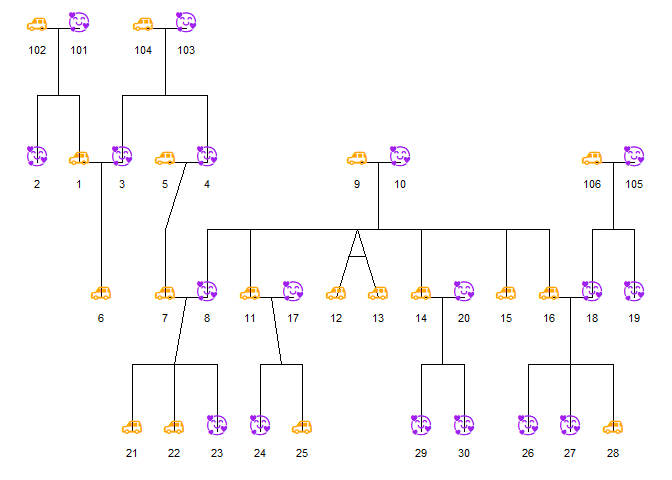
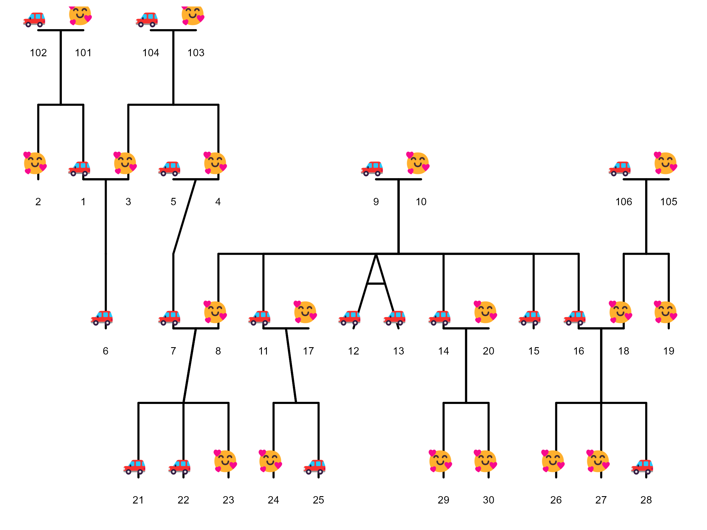

```{r setup, include=FALSE}
knitr::opts_chunk$set(
  collapse = TRUE,
  comment = "#>",
  fig.width = 7,
  fig.height = 5
)
```

```{r libraries, message=FALSE, warning=FALSE}
library(ggpedigree) # ggPedigree lives here
library(BGmisc) # helper utilities & example data
library(ggplot2) # ggplot2 for plotting
library(viridis) # viridis for color palettes
library(tidyverse) # for data wrangling
```

Every gg-based plotting function in `{ggpedigree}` accepts a `config` argument. This is an easier way to control plot behavior without rewriting the plotting code.

As already discussed, a `config` is a named list. Each element corresponds to one plotting, layout, or aesthetic option. You pass the list to the plotting function and the plot is drawn using those values.

You do not need to supply every option. You only provide the options you want to change. Any options you do not specify will use the package defaults. You can see a full list of supported options and their defaults by reviewing the documentation for `getDefaultPlotConfig()`.


# Basic usage of `config` in `ggPedigree()`

As before, we will use the `potter` pedigree dataset bundled in `{BGmisc}`.

```{r}
library(BGmisc)
data("potter")
```

A basic pedigree plot uses defaults:

```{r}
ggPedigree(
  potter,
  famID = "famID",
  personID = "personID",
  momID = "momID",
  dadID = "dadID"
)
```

## Sex coding: `code_male` and `code_female`

`ggPedigree()` (and other ggpedigree plots that use sex) need to know how sex is encoded in your data so they can assign the correct **shapes** (and optionally **colors**) for female, male, and unknown.

The `code_male` and `code_female` config options define which values in your sex column should be treated as male vs female. The defaults assume:

-   `code_female = 0`
-   `code_male = 1`

If your dataset uses different codes (for example `1/2` or `"M"/"F"`), override these in `config`.

``` r
# Example: sex coded as 1 = male, 2 = female
ggPedigree(
  ped,
  famID = "famID",
  personID = "personID",
  momID = "momID",
  dadID = "dadID",
  config = list(
    code_male = 1,
    code_female = 2,
    code_unknown = 3
  )
)

# Example: sex coded as "M" / "F"
ggPedigree(
  ped,
  famID = "famID",
  personID = "personID",
  momID = "momID",
  dadID = "dadID",
  config = list(
    code_male = "M",
    code_female = "F"
  )
)
```

Once the sex codes are interpreted correctly, the plot uses the corresponding shape settings (`sex_shape_female`, `sex_shape_male`, `sex_shape_unknown`) and, when enabled, sex-based coloring (`sex_color_include`, `sex_color_palette`).

# Customizing specific plot components via `config`

The rest of this section demonstrates how `config` affects specific components of the pedigree plot.

## 1) Labels

Label behavior is controlled by keys such as:

-   `label_include`
-   `label_column`
-   `label_method`
-   `label_max_overlaps`
-   `label_text_color`, `label_text_family`
-   `label_text_size`
-   `label_nudge_x`, `label_nudge_y`
-   `label_text_angle`

This example customizes labels. Here we label individuals by `first_name`, enlarge label text, and nudge the labels down slightly.

```{r}
ggPedigree(
  potter,
  famID = "famID",
  personID = "personID",
  momID = "momID",
  dadID = "dadID",
  config = list(
    label_include = TRUE,
    label_column = "first_name",
    label_text_size = 3.2,
    label_nudge_y = 0.15
  )
)
```

To turn labels off completely:

```{r}
ggPedigree(
  potter,
  famID = "famID",
  personID = "personID",
  momID = "momID",
  dadID = "dadID",
  config = list(label_include = FALSE)
)
```

You can also use repelled labels to avoid overlaps:

```{r}
ggPedigree(
  potter,
  famID = "famID",
  personID = "personID",
  momID = "momID",
  dadID = "dadID",
  config = list(
    label_include = TRUE,
    label_method = "geom_text_repel",
    label_max_overlaps = 10,
    label_text_size = 9,
    label_segment_color = "grey50"
  )
)
```

Note that short labels are less likely to overlap, so consider abbreviating labels if your pedigree is dense. In this example, I enlarged the text size to demonstrate repulsion more clearly.

## 2) Points and outlines

Point size and whether points scale automatically are controlled by:

-   `point_size`
-   `point_scale_by_pedigree`

Outlines are controlled by:

-   `outline_include`
-   `outline_multiplier`
-   `outline_color`
-   `outline_alpha`

This example disables automatic point scaling and adds black outlines to points.

```{r}
ggPedigree(
  potter,
  famID = "famID",
  personID = "personID",
  momID = "momID",
  dadID = "dadID",
  config = list(
    point_scale_by_pedigree = FALSE,
    point_size = 6,
    outline_include = TRUE,
    outline_color = "maroon",
    outline_multiplier = 1.5,
    outline_alpha = 1
  )
)
```

## 3) Segments (relationships)

Segments are controlled by options such as:

-   `segment_linewidth`, `segment_linetype`
-   `segment_offspring_color`, `segment_parent_color`, `segment_spouse_color`
-   `segment_self_*` for self-loops
-   `segment_mz_*` for MZ twin segments

This example thickens relationship segments and changes the spouse segment color.

```{r}
ggPedigree(
  potter,
  famID = "famID",
  personID = "personID",
  momID = "momID",
  dadID = "dadID",
  config = list(
    segment_linewidth = 2,
    segment_spouse_color = "steelblue",
    segment_parent_color = "black",
    segment_offspring_color = "black"
  )
)
```

Self-loop geometry is also configurable:

```{r}
ggPedigree(
  inbreeding %>% filter(famID %in% 5),
  famID = "famID",
  personID = "ID",
  momID = "momID",
  dadID = "dadID",
  config = list(
    segment_self_linetype = "dotdash",
    segment_self_color = "hotpink",
    segment_self_alpha = 0.6,
    segment_self_linewidth = 1.5,
    segment_self_curvature = -0.2,
    segment_self_angle = 80,
    code_male = 0
  )
) + ggtitle("Custom self-loop appearance")
```

## 4) Sex appearance

Sex is controlled by:

-   `sex_color_include`
-   `sex_color_palette`
-   `sex_shape_female`, `sex_shape_male`, `sex_shape_unknown`
-   `sex_legend_show`, `sex_legend_title`

This example shows sex legend and customizes shapes.

Here I use shapes 17 (triangle) for males, 18 (diamond) for females, and 16 (circle) for unknown. You can find a full list of shape codes in the `pch` documentation (`?points`). You can also use shapes from the `ggplot2` shape palette (e.g., 21-25 for filled shapes). Here I also disable sex coloring to focus on shapes alone.

```{r}
ggPedigree(
  potter,
  famID = "famID",
  personID = "personID",
  momID = "momID",
  dadID = "dadID",
  config = list(
    sex_legend_show = TRUE,
    sex_shape_female = 18,
    sex_shape_male = 17,
    sex_shape_unknown = 16,
    sex_color_include = FALSE
  )
)
```

Below, I use a custom color palette for sex as well as emoji shapes for fun.

```{r}
plot_ped <- ggPedigree(
  potter,
  famID = "famID",
  personID = "personID",
  momID = "momID",
  dadID = "dadID",
  config = list(
    sex_color_palette = c("purple", "orange", "grey50"),
    sex_shape_female = "🥰",
    sex_shape_male = "🚗"
  )
)

ggplot2::ggsave(
  filename = "custom_sex_emoji_pedigree.png",
  plot = plot_ped,
  width = 8,
  height = 6,
  dpi = 300
)
```


{width="7in" height="5in"}

Note that when using emoji shapes, it is best to use `ggsave()` to save the plot to a file, as some R graphics devices may  render emoji differently. Notice how the emoji shapes appear in the saved PNG file below compares to the image rendered during the preview above. These may vary because of differences in font rendering.

{width="7in" height="5in"}


## 5) Affected status overlay

Affected status behavior is controlled by keys such as:

-   `status_include`
-   `status_code_affected`, `status_code_unaffected`
-   `status_alpha_affected`, `status_alpha_unaffected`
-   `status_color_affected`, `status_color_unaffected`
-   `status_legend_show`

If your dataset includes an affected status column, you can control how affected status is drawn.

Below is a template showing the relevant config keys. Here I use the `hazard` dataset from `{BGmisc}`. The `affected` column uses 1 for affected and 0 for unaffected.

```{r}
ggPedigree(
  hazard,
  famID = "famID",
  personID = "ID",
  momID = "momID",
  dadID = "dadID",
  status_column = "affected",
  config = list(
    code_male = 0,
    status_include = TRUE,
    status_code_affected = 1,
    status_code_unaffected = 0,
    status_alpha_affected = .6,
    status_alpha_unaffected = 0,
    status_color_affected = "red",
    status_shape_affected = 8,
    status_legend_show = TRUE
  )
)
```

## 6) Focal fill: highlighting relatives of a focal individual

A common analysis task is to pick a focal individual and visually emphasize how strongly other individuals are related to that focal person. In `{ggpedigree}`, this is handled by **focal fill**. When focal fill is enabled, node fill colors are mapped to a focal-based value (for example additive genetic relatedness or another focal-derived scalar).

Focal fill is controlled entirely through `config`. The minimal ingredients are:

-   `focal_fill_include = TRUE`
-   `focal_fill_personID = <ID of focal person>`
-   `focal_fill_component = <component to use for focal calculation>`. It can be `"additive"` (default), `"mitochondrial"`, `"patID"`, or `"matID"`.
-   `focal_fill_method` is the Method used for focal fill gradient. Options are 'steps', 'steps2', 'step', 'step2', 'viridis_c', 'viridis_d', 'viridis_b', 'manual', 'hue', 'gradient2', 'gradient'.

### Turning focal fill on

Below we choose an individual as the focal person, enable focal fill, and disable sex coloring to highlight the focal fill pattern clearly. The exact person identifier must match the `personID` column used in the plot.

```{r}
ggPedigree(
  potter,
  famID = "famID",
  personID = "personID",
  momID = "momID",
  dadID = "dadID",
  config = list(
    focal_fill_include = TRUE,
    sex_color_include = FALSE,
    focal_fill_component = "additive",
    focal_fill_personID = 8,
    focal_fill_legend_show = TRUE,
    focal_fill_legend_title = "Focal relatedness"
  )
)
```

If the plot is dense, it is often helpful to turn labels off or reduce their prominence, so the focal fill pattern reads cleanly. Note we can also choose different focal components such as `"mitochondrial"`, which traces matrilineal relatedness.

```{r}
ggPedigree(
  potter,
  famID = "famID",
  personID = "personID",
  momID = "momID",
  dadID = "dadID",
  config = list(
    focal_fill_include = TRUE,
    sex_color_include = FALSE,
    focal_fill_personID = 8,
    focal_fill_component = "mitochondrial",
    label_include = FALSE,
    point_scale_by_pedigree = FALSE,
    point_size = 6
  )
)
```

### Choosing the focal fill scale and colors

Focal fill supports multiple scale methods via `focal_fill_method`. For continuous gradients, the most common choice is `"gradient"` (default) or `"gradient2"`.

You can explicitly set the low/mid/high colors used by the focal gradient:

```{r}
ggPedigree(
  potter,
  famID = "famID",
  personID = "personID",
  momID = "momID",
  dadID = "dadID",
  config = list(
    focal_fill_include = TRUE,
    sex_color_include = FALSE,
    focal_fill_personID = 8,
    focal_fill_method = "gradient2",
    focal_fill_low_color = "purple",
    focal_fill_mid_color = "orange",
    focal_fill_high_color = "red",
    focal_fill_scale_midpoint = 0.50,
    focal_fill_legend_show = TRUE
  )
)
```

### Discrete focal fill palettes

If you prefer discrete bins rather than a continuous gradient, you can use step-based scales (for example `"steps"` / `"steps2"`). When using step-based methods, `focal_fill_n_breaks` controls the number of discrete breaks.

```{r}
ggPedigree(
  potter,
  famID = "famID",
  personID = "personID",
  momID = "momID",
  dadID = "dadID",
  config = list(
    focal_fill_include = TRUE,
    sex_color_include = FALSE,
    focal_fill_personID = 8,
    focal_fill_method = "steps2",
    focal_fill_n_breaks = 9,
    focal_fill_legend_show = TRUE
  )
)
```

### Handling missing and zero values

When focal fill is computed, some individuals can have missing focal values (for example if they are disconnected). You can control the color used for missing values with `focal_fill_na_value`. The `focal_fill_force_zero` option forces exact zeros to be treated as missing so they can be filled in using `focal_fill_na_value`.

```{r}
ggPedigree(
  potter,
  famID = "famID",
  personID = "personID",
  momID = "momID",
  dadID = "dadID",
  config = list(
    focal_fill_include = TRUE,
    sex_color_include = FALSE,
    focal_fill_personID = 4,
    focal_fill_force_zero = TRUE,
    focal_fill_na_value = "grey75"
  )
)
```

### Using viridis-based focal fill

If you want perceptually uniform color scaling, focal fill supports viridis options through `focal_fill_method = "viridis_c"` (continuous) or `"viridis_d"` (discrete). You can control the viridis option and range using:

-   `focal_fill_viridis_option`
-   `focal_fill_viridis_begin`
-   `focal_fill_viridis_end`
-   `focal_fill_viridis_direction`

Here the focal fill is drawn using paternal relatedness. Each individual's fill color indicates which patriline they belong to, colored using a discrete viridis palette.

```{r}
ggPedigree(
  potter,
  famID = "famID",
  personID = "personID",
  momID = "momID",
  dadID = "dadID",
  config = list(
    focal_fill_include = TRUE,
    sex_color_include = FALSE,
    focal_fill_personID = 5,
    focal_fill_method = "viridis_d",
    focal_fill_component = "patID",
    focal_fill_viridis_option = "D",
    focal_fill_viridis_begin = 0.05,
    focal_fill_viridis_end = 0.95,
    focal_fill_viridis_direction = 1,
    focal_fill_legend_show = TRUE
  )
)
```

## 7) Global greyscale / black-and-white switch

If you want a black-and-white plot, you can request it using:

-   `color_theme = "greyscale"` (also accepts `"bw"`, `"black"`, etc.)

This triggers coordinated adjustments so the plot remains coherent without manually changing multiple palettes.

```{r}
ggPedigree(
  potter,
  famID = "famID",
  personID = "personID",
  momID = "momID",
  dadID = "dadID",
  config = list(
    color_theme = "bw",
    focal_fill_include = TRUE,
    sex_color_include = FALSE,
    focal_fill_personID = 5,
    segment_linewidth = 0.7,
    point_scale_by_pedigree = FALSE,
    point_size = 6
  )
)
```

## 8) Interactive pedigrees: `ggPedigreeInteractive()`

Interactive pedigrees usually require thinner segments and careful tooltip selection. Tooltips are controlled primarily through `tooltip_columns`, while most drawing options are still handled by `config`.

```{r}
ggPedigreeInteractive(
  potter,
  famID = "famID",
  personID = "personID",
  momID = "momID",
  dadID = "dadID",
  tooltip_columns = c("personID", "first_name", "sex"),
  config = list(
    label_include = FALSE,
    point_scale_by_pedigree = FALSE,
    point_size = 7,
    segment_linewidth = 0.5
  )
)
```


# Saving and loading a config file

If you want to reuse the same overrides across scripts or share them with collaborators, save your config list.

```{r}
cfg <- list(
  point_scale_by_pedigree = FALSE,
  point_size = 6,
  segment_linewidth = 0.7,
  label_include = TRUE,
  label_text_size = 3,
  sex_color_palette = c("purple", "orange", "grey50")
)

saveRDS(cfg, file = "ggpedigree_config.rds")

cfg <- readRDS("ggpedigree_config.rds")

ggPedigree(
  potter,
  famID = "famID",
  personID = "personID",
  momID = "momID",
  dadID = "dadID",
  config = cfg
)
```

# Config reference

The `config` argument accepts many options. Most users will only change a small subset, but the full list of supported keys can be printed programmatically.

<details>

<summary><strong>Show all config keys (names only)</strong></summary>

```{r}
cfg_names <- sort(names(getDefaultPlotConfig("ggPedigree")))

tibble::tibble(Config_Key = cfg_names) %>%
  knitr::kable()
```

</details>

<details>

<summary><strong>Show all config keys with defaults</strong></summary>

</details>
